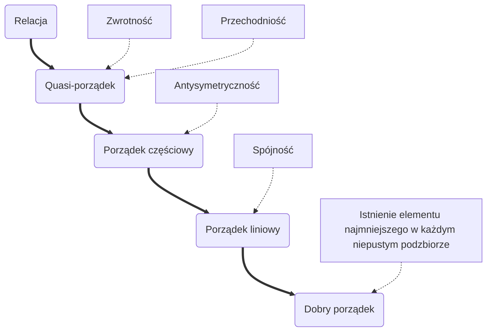

# Przedmowa {-}

To są notatki z przedmiotu Elementy Logiki i Teorii Mnogości prowadzonego na
kierunku IAD w 2024 roku przez dr Małgorzatę Murat. Treści obejmują 12 wykładów
z 15 (pierwsze trzy nie były notowane).

Autor starał się notować najlepiej jak potrafi, jednak mógł przepisać źle. W
wykładach również zdarzały się niedoprecyzowania lub błędy i jeśli były
zauważone, były poprawione, jednak to nie oznacza, że treści notatek są
bezbłędne (w tym gramatycznie).

Notatki znajdują się w **domenie publicznej** na warunkach licencji CC0 1.0
Universal[^license-link]. Kod źródłowy można znaleźć w repozytorium na GitHub
<https://github.com/wmit-materialy/notatki>

[^license-link]: <https://creativecommons.org/publicdomain/zero/1.0/deed.pl>

```{=latex}
\newpage
```

2023-10-27

# Teoria mnogości

## Podstawowe definicje teorii mnogości

Para uporządkowana
: Parą uporządkowaną $(a, b)$ nazywamy zbiór $\{\{a\}, \{a, b\}\}$, gdzie

  - $a$ - poprzednik pary
  - $b$ - następnik pary

::: {.theorem title="Równość par" ref=""}

Dwie pary $(a, b)$, $(c, d)$ są równe wtw, gdy $a = c \land b = d$

Wprost z definicji wynika, że $A\times B \neq B\times A$

$$
\begin{aligned}
  (a, b) = \{\{a\},\{a, b\}\}\\
  (b, b) = \{\{b\},\{a, b\}\}
\end{aligned}
$$

:::

Iloczyn kartezjański
: Iloczynem kartezjańskim zbiorów $A, B$ nazywamy zbiór par uporządkowanych
  $(a, b)$, takich, że $a \in  A$, $b \in B$.

Zbiór potęgowy
: Zbiorem potęgowym $P(X)$ nazywamy zbiór wszystkich podzbiorów zbioru $X$.
  Moc zbioru potęgowego $\left| P(X) \right| = 2^{\left| X \right| }$

Indeksowana rodzina zbiorów
: Indeksowaną rodziną zbiorów nazywamy funkcję $x: I \to X$, gdzie $I$ – zbiór
  indeksów. $x : i \mapsto x(i) = x_i$. Zwyczajowo zamiast pisania $x(i)$ piszę
  się $x_i$.

### Uogólniona suma zbiorów

Uogólniona suma zbiorów
: Uogólnioną sumą indeksowanej rodziny zbiorów $\{A_i : i \in I\}$ nazywamy
  zbiór elementów które należą do co najmniej jednego ze zbiorów $A_i, i \in I$.

  $$
    A_1 \cup A_2 \cup \ldots \cup A_n = \bigcup_{i=1}^n A_i
  $$

$$
\begin{aligned}
	 x \in \bigcup_{i=1}^n &\iff
	 (x \in A_1 \lor x \in A_2 \lor \ldots \lor x \in A_n) \\&\iff
	 \exists_{i \in \{1, 2, \ldots, n\}  } x \in A_i
\end{aligned}
$$

$$
\forall_{x\in U}
\left[
x \in \bigcup_{i\in I} A_i
\iff
\exists _{i\in I} x \in A_i
\right]
$$

### Uogólniony iloczyn zbiorów

Uogólniony iloczyn zbiorów
: Uogólnionym iloczynem indeksowanej rodziny zbiorów $\{A_i: i \in I\}$ nazywamy
  zbiór złożony z elementów, które należą do każdego ze zbiorów $A_i, i \in I$.
  $$
    A_1 \cap A_2 \cap \ldots \cap A_n = \bigcap_{i=1}^n A_i
  $$

$$
\begin{aligned}
	 x \in \bigcap_{i=1}^n &\iff
	 (x \in A_1 \land x \in A_2 \land \ldots \land x \in A_n) \\&\iff
	 \forall_{i \in \{1, 2, \ldots, n\}} x \in A_i
\end{aligned}
$$

$$
\forall_{x\in U}
\left[
x \in \bigcap_{i\in I} A_i
\iff
\forall_{i\in I} x \in A_i
\right]
$$

::: {.example title="" ref=""}

$$
\begin{aligned}
  I = \mathbb{N}_+, X = \mathbb{N}
  f : \mathbb{N}_+ \to P(\mathbb{N})
  f(i) = \{ik: k \in \mathbb{N}\}
\end{aligned}
$$

$$
  A_1 = \{1\cdot k: k \in N\} = \{0, 1, 2, 3,\ldots \} = \mathbb{N}
$$

$$
  A_2 = \{2k: k \in N\} = \{0, 2, 4, 6, \ldots\}
$$

$$
  A_{11} = \{11k: k \in \mathbb{N}\} \text{ – zbiór liczb nieujemnych podzielnych przez 11}
$$

$$
  \bigcap _{i\in \mathbb{N}_+} A_i = \{0\} \qquad
  \bigcup _{i\in \mathbb{N}_+} A_i = \mathbb{N}
$$

:::

## Aksjomaty teorii mnogości

Aksjomat ekstensjonalności
: Dwa zbiory są równe jeśli mają te same elementy.
  $$
    \forall _{x} \forall _y
    [x = y \Leftrightarrow \forall_t (t \in x \Leftrightarrow t \in y)]
  $$

Aksjomat zbioru pustego
: Istnieje zbiór który nie ma elementów.
  $$
    \exists _x \forall _y \neg (y \in x)
  $$

Aksjomat pary
: Dla dowolnych dwóch elementów istnieje zbiór którego elementami są jedynie
  zbiory $x$ i $y$.
  $$
    \forall_x \forall_y \exists_z \forall_t
    [t \in z \Leftrightarrow(t = x \lor t = y)]
  $$
  Zbiór, o którym mowa w aksjomacie pary nazywamy parą (nieporządkowaną) i
  oznaczamy $\{x, y\}$.

Aksjomat sumy
: Dla dowolnego zbioru $x$ istnieje zbiór $y$, którego elementami są tylko i
  wyłącznie elementy zbioru $x$.
: Zbiór $y$ oznacza się $\bigcup x$.
  $$
    \forall _x \exists _y \forall _z
    [z \in y \Leftrightarrow \forall _{t\in x} x \in t]
  $$

Aksjomat zbioru potęgowego
: Dla każdego zbioru $x$ istnieje zbiór $p$, którego jedynymi elementami są
  dokładnie podzbiory zbioru $x$.
  $$
    \forall_x \exists_y \forall_z
    [z \in y \Leftrightarrow \forall_t\ t \in z \Rightarrow t \in x]
  $$

Aksjomat nieskończoności
: Istnieje zbiór induktywny $A$, taki, że

  1. $A \in X$,
  2. $\forall_{A}\ \ A \in X \Leftrightarrow S(A) \in X$, gdzie
     $S(A) = A \cup \{A\}$.

Takim zbiorem jest na przykład
$$
\{
  {\color{red} \varnothing},
  {\color{green}\{\varnothing\}},
  {\color{blue}\{\varnothing, \{\varnothing\}\}},
  {\color{magenta}\{\varnothing, \{\varnothing\}, \{\varnothing, \{\varnothing\}\}\}},
  \ldots
\}
$$

Aksjomat podzbiorów
: Dla każdego zbioru $a$ istnieje zbiór $b$ złożony tylko z takich elementów
  zbioru $a$, które mają własność $\phi$.

Aksjomat wyboru
: Dla każdej rodziny niepustych i rozłącznych zbiorów istnieje zbiór złożony z
  jednego elementu każdego zbioru tej rodziny.

Aksjomat regularności (ufundowania)
: Każdy niepusty zbiór $x$ ma element rozłączny z $x$.

# Relacja binarna

Relacja binarna (dwuargumentowa)
: Każdy podzbiór iloczynu kartezjańskiego zbiorów $X, Y$ (tj. $X\times Y$)
  nazywamy relacją w iloczynie kartezjańskim zbiorów $X$ i $Y$
  (krótko relacją w $X\times Y$)

: Relacja jest albo zbiorem pustym, albo zbiorem par uporządkowanych

: Istnienie pary $(x, y)$ w relacji $R$ oznacza, że $x$ jest w relacji z $y$
  $$
    (x, y) \in R \iff x R y
  $$


::: {.example title="" ref=""}

$$
\begin{aligned}
  &{\le} \subseteq \mathbb{R}\times \mathbb{R}\\&
  1 \le 2 \quad
  \begin{aligned}
  (1,2) \in {\le}\\
  (2, 1) \not \in {\le}
  \end{aligned}
\end{aligned}
$$

:::

::: {.example title="" ref=""}

$$
 \begin{aligned}
 R \subseteq \mathbb{N}_+ \times \mathbb{N}_+\\
 (x, y) \in R \iff x | y\\
 (1, 2) \in R\ \ \ \ \ (4, 64) \in R
 \end{aligned}
$$

:::

Zamiast pisać $(x, y) \in R$ będziemy pisać $xRy$ oraz oznaczymy $X\times X =
X^2$, zatem $\mathbb{R}^2 = \mathbb{R}\times \mathbb{R}$,
$\mathbb{R}^3 = \mathbb{R}\times \mathbb{R}\times \mathbb{R}$

Jeżeli relacja $R$ jest zdefiniowana w $X^2$, to będziemy mówić, że
«$R$ jest zdefiniowana w $X^2$».

## Działania na relacjach

Na relacjach jako zbiorach możemy wykonywać operacje sumowania ($\cup$),
odejmowania ($\setminus$), znajdowania części wspólnych ($\cap$) w sensie teorii
mnogości. Możemy też tworzyć iloczyny kartezjańskie ($\times$).

## Dziedzina relacji

Dziedzina relacji
: Dziedziną relacji $R \subseteq X\times Y$ nazywamy zbiór poprzedników par
  należących do relacji $R$
: Będziemy pisać $D(R) = \{x\in X: xRy\}$

## Przeciwdziedzina relacji

Przeciwdziedzina relacji
: Przeciwdziedziną relacji $R \subseteq X \times Y$ nazywamy zbiór następników par
  należących do relacji $R$.
: Będziemy pisać $\operatorname{PD} (R) = \{y \in Y: xRy\}$

::: {.example title="" ref=""}

Niech $X = \{2, 3, 4\}$, $Y = \{1, 2, 3, 4, 5, 6, 7\}$,
oraz $xRy \overset{def}{\iff} x | y$

$$
\begin{aligned}
  R = \{(2, 2), (2, 4), (2, 6), (3, 3), (3, 6), (4, 4)\}\\
  D(R) = \{2, 3, 4\} = X \quad \text{oraz} \quad
  \operatorname{PD} (R) = \{2, 4, 6, 3\} \ne Y
\end{aligned}
$$

:::

---

2023-11-03

Obraz
: Obrazem zbioru $A$ względem relacji $R$ nazywamy zbiór następników par $(x, y) \in R$,
  gdzie poprzedniki należą do zbioru $A$, czyli $x \in A$.
  $$
   \vec{R} (A) = \{y \in Y: \exists_{x\in A} x R y\}
  $$

Przeciwobraz
: Przeciwobrazem zbioru $B$ względem relacji $R$ nazywamy zbiór poprzedników par
  $(x, y) \in R$, następniki których należą do zbioru $B$, czyli $y \in B$.
  $$
   \vec{R}^{-1} (B) = \{x \in X: \exists_{y\in B} x R y\}
  $$

Relacja odwrotna
: Relacją odwrotną $R^{-1}$ do relacji $R \subseteq X\times Y$ nazywamy relację
  $R^{-1} \subseteq Y \times X$, taką, że $y R^{-1} x \iff xRy$

Złożenie relacji
: Złożenie relacji $R \subseteq X\times Y$ z relacją $S \in Y\times Z$ nazywamy
  relację $R \circ S$, taką, że
  $$
  \forall_{{\color{red}x} \in {\color{red}X}}
  \forall_{{\color{blue}z} \in {\color{blue}Z}}\ \
  \left[
    {\color{red}x} (R \circ S) {\color{blue}z} \Leftrightarrow
    \left( \exists_{{\color{ForestGreen}y} \in {\color{ForestGreen}Y}}\ \
    {\color{red}x} R {\color{ForestGreen}y}
    \land {\color{ForestGreen}y} S {\color{blue}z} \right)
  \right]
  $$


## Funkcja

Funkcja
: Funkcją nazywamy relację dwuargumentową $f \subseteq X\times Y$, gdy dla
  każdego $x \in X$ istnieje co najwyżej jeden $y \in Y$, taki że $xfy$

Relacja $f \subset X\times Y$ jest funkcją wtw, gdy spełnia dwa warunki:

1. $\displaystyle \forall_{x \in X}\ \exists_{y \in Y}\; xfy$ (warunek istnienia)
2. $\forall_{x \in X}\; \forall_{y_1, y_2 \in Y}\;
    (xfy_1 \land xfy_2 \implies y_1 = y_2)$ (warunek jednoznaczności)

### Złożenie funkcji

Złożenie funkcji jest operacją łączną
(tzn. $(f \circ g) \circ h = f \circ (g \circ h)$),
ale nie jest przemienną (tzn. $f \circ g = g \circ f$ nie zachodzi w przypadku
ogólnym).

## Inne typy relacji

Funkcja częściowa
: Funkcją częściową nazywamy relację $R \subseteq X\times Y$, która spełnia
  warunek jednoznaczności
  $$
    \forall_{x \in X}\; \forall_{y_1, y_2 \in Y_f}\;
    (xfy_1 \land xfy_2 \implies y_1 = y_2)
  $$

: Funkcja częściowa funkcji $f : X \to Y$ jest zdefiniowana tylko dla podzbioru
  $S \subset X$, a nie dla całego zbioru $X$.

::: {.example title="" ref=""}

Funkcja $f(x) = x^2$ jest funkcją częściową, bo jest funkcją, a każda funkcja
jest funkcją częściową.

:::

Iniekcja
: Iniekcją nazywamy funkcję $f: X \to Y$, każdy element przeciwdziedziny której
  jest przyjmowany co najwyżej raz, formalnie:
  $$
   \forall_{a \in X} \forall_{b \in X}\; a \neq b \Rightarrow f(a) \neq f(b)
  $$

Surjekcja
: Surjekcją nazywamy funkcję $f : X \to Y$, która przyjmuje każdą wartość ze swojej
  przeciwdziedziny, tzn. dla takiej funkcji jej obraz jest jej przeciwdziedziną.
  $$
  \forall_{Y \in y} \exists_{x \in X}\ \ y = f(x)
  $$

::: {.example title="" ref=""}

Funkcja $f(x) = x^2$ nie jest surjekcją na $\mathbb{R}$, bo np. dla $f(x) = -1$
nie istnieje $x$ w dziedzinie $\mathbb{R}$

:::

Bijekcja
: Bijekcją nazywamy funkcję, która jest injekcją i surjekcją

::: {.example title="" ref=""}

Przykładem funkcji bijekcyjnej jest funkcja identycznościowa:

$$
  I \subseteq \mathbb{R}^2 \quad
  I = \{(x, x) \in \mathbb{R}\}, \text{ czyli } I(x) = x
$$

:::

---

2023-11-10

## Funkcja odwracalna

$f \subseteq X\times Y$ jest odwracalna wtedy i tylko wtedy, gdy $f$ jest
bijekcją

::: {.proof title="" ref=""}

$$
  (g \circ f) = I_x\qquad (f \circ g) = I_y
$$

$$
  (p \iff q) \iff (\neg p \iff \neg q)
$$

Załóżmy, że $f$ jest odwracalna, tzn. istnieje funkcja $g \subseteq Y\times X$
taka, że:
$$
  g \circ f = I_X\qquad f \circ g = I_Y
$$

Zauważmy, że z samej definicji $I_Y, I_Y$ wynika, że $I_X$ i $I_Y$ są bijekcjami
$$
  I_X \subseteq X^2, I_X(x) = x
$$

Zatem $g \circ f$ też jest bijekcją, czyli:
$$
  \bigwedge_{x_1, x_2 \in  X}
  x_1 \neq  x_2 \implies g\circ f (x_1) \neq g\circ f(x_2)
$$

Stąd wynika, że $f(x_1) \neq  f(x_2)$, bo gdyby tak nie było, to
$g\circ f (x_1) = g\circ f(x_2)$. Czyli $I_x(x_1) = I_x(x_2)$, a z definicji
$I_x$ wynikałoby, że $x_1 = x_2$, sprzeczne z wyborem $x_1, x_2$.

Przy okazji udowodniliśmy, że jeśli $g \circ f$ jest iniekcją, to $f$ jest też
iniekcją.

Założyliśmy, że $f \subseteq X\times Y$ jest odwracalna, zatem $f\circ g = I_y$.
Stąd wynika, że $\forall_{y\in Y}\; f(g(y)) = y$

Zauważmy, że z tego wynika $Y = f(g(Y))$

Z drugiej strony: ponieważ $g \subseteq Y\times X$, więc $f(g(Y)) \subseteq f(X)$

Mamy więc $Y \subseteq f(X) \subseteq Y$, co oznacza, że $f(X) = Y$,
$f\subseteq X\times Y$. Zatem $f$ jest surjekcją. Tym samym $f$ jest bijekcją.

Załóżmy teraz, że $f$ jest bijekcją. Wtedy z faktu, że $f$ jest surjekcją
wynika, że
$$
  \bigwedge_{y\in Y} \bigvee_{x\in X} f(x) = y
$$

Z faktu, że $f$ jest iniekcją, wynika, że wyżej wymieniony $x \in X$ jest
dokładnie jeden. Oznacza to, że dla wyżej wymielonych $x, y$ istnieje
$g \subseteq Y\times X$ takie, że

$$
  y = f(x) \iff g(y) = x
$$

{width=50%}

Z dowolności $x \in X$ i $y \in Y$ wynika, że istnieje $g \subseteq Y\times X$
taka, że

$$
 g(y) = x \iff y = f(x)
$$

Zatem

- $x = g(y) = g(f(x))$ dla dowolnego $x \in X$
- $y = f(x) = f(g(y))$ dla dowolnego $y \in Y$

Oznacza to, że $g\circ f = I_x$ i $f\circ g = I_y$

Dowiedliśmy, że $f$ jest odwracalna

:::

### Wniosek z twierdzenia

Zauważmy, że z powyższego twierdzenia wynika, iż funkcja $g$ o własnościach
występujących w definicji funkcji odwracalnej istnieje dokładnie jeden.

Gdyby tak nie było, istniały by funkcje $g_1 \subseteq Y\times X$ oraz
$g_2 \subseteq Y\times X$ takie, że

- $g_1\circ f = I_x$ oraz $g_2\circ f = I_x$
- $f \circ g_1 = I_y$ oraz $f \circ g_2 = I_y$

Wtedy dla dowolnych $x \in X$ mielibyśmy $g_1(f(x)) = x$ i $g_2(f(x)) = x$

Ponieważ $f$ jest odwracalna, a więc musi być injekcją, to mamy $g_1(f(x)) =
g_2(f(x))$, co oznacza, że $g_1 = g_2$

Ponieważ istnieje dokładnie jedna funkcja spełniająca warunki w definicji
funkcji odwracalnej, to będziemy używać oznaczenia $g = f^{-1}$ i nazywać ją
funkcją odwrotną.

::: {.theorem title="" ref=""}

Jeżeli $f \subseteq X\times Y$ i $g \subseteq Y\times Z$ są bijekcjami, to
istnieje $(g\circ f)^{-1}$ oraz

$$
 (g\circ f)^{-1} = f^{-1} \circ g^{-1}
$$

:::

::: {.proof title="" ref=""}

Załóżmy, że $f\subseteq X\times Y$ i $g\subseteq Y\times Z$ są bijekcjami, wtedy
złożenie funkcji $g\circ f$ też jest bijekcją, a więc jest odwracalne

Niech $x\in X$ i $z\in Z$ będą takie, że
$$
  g(f(x)) = z
$$

Wtedy istnieje $y\in Y$ taki, że $g(y) = z$ i $f(x) = y$ z definicji funkcji
złożonej

Założyliśmy, że $g$ i $f$ są bijekcjami, zatem istnieją funkcje do nich odwrotne
$g^{-1}(x) = y$ i $f^{-1}(y) = x$

Z definicji złożenia funkcji wynika, że $x = f^{-1}(y) = f^{-1}(g^{-1}(z))$,
gdzie

- $f^{-1} \subset Y\times X$,
- $g^{-1} \subseteq Z\times Y$

Ponadto $g(f(x)) = z \iff (g\circ f)(x) = z$.

Zauważmy, że
$$
\forall x\in X\;
\forall z\in Z\;
[(z,x) \in (g\circ f)^{-1} \land (z, x) \in (f^{-1} \circ g^{-1})]
$$

Innymi słowy mamy
$$
 g(f(x)) = z \iff (g\circ f)^{-1}(z) = x = (f^{-1}\circ g^{-1})(z)
$$

Co oznacza, że $(g\circ f)^{-1} = f^{-1} \circ g^{-1}$.

:::

## Cechy relacji

Zwrotność
: Relację $R \subseteq X^2$ nazywamy zwrotną wtw, gdy
  $$
    \bigwedge_{x \in X} xRx
  $$

Symetryczność
: Relację nazywamy zwrotną wtw, gdy
  $$
    \bigwedge_{x,y \in X} xRy \implies yRx
  $$

Przechodniość
: Relację nazywamy przechodnią wtw, gdy
  $$
   \bigwedge_{x,y,z \in X} (xRy \land yRz) \implies xRz
  $$

Przeciwzwrotność
: Relację nazywamy przeciwzwrotną wtw, gdy
  $$
    \bigwedge_{x \in X} \neg xRx
  $$

Antysymetryczność
: Relację nazywamy antysymetryczną wtw, gdy
  $$
    \bigwedge_{x, y \in X} (xRy \land yRx) \implies x = y
  $$

Spójność
: Relację nazywamy spójną wtw, gdy
  $$
    \bigwedge_{x,y\in X} xRy \lor yRx
  $$

## Relacja równoważności ^[dodatkowe materiały: <https://wojcienty.com/artykul/12/matematyka/teoria_mnogosci/relacje_rownowaznosci_i_klasy_abstrakcji/>]

Relację $R \subseteq X^2$ nazywamy relacją równoważności wtw, gdy jest ona
zwrotna, symetryczna, przechodnia

### Klasa abstrakcji

Klasą abstrakcji elementu $x \in X$ względem relacji równoważności
$R\subseteq X^2$ nazywamy zbiór tych elementów $y \in X$, które są w relacji z
elementem $x$

Będziemy pisać $[x]_R = \{y \in X: yRx\}$

### Zbiór ilorazowy

Zbiór klas abstrakcji względem relacji równoważności $R \subseteq X^2$ nazywamy
**zbiorem ilorazowym**

Zbiór ilorazowy jest podziałem relacji równoważności


Podział zbioru
: Podziałem (partycją, rozbiciem) niepustego zbioru $X$ nazywamy podzbiór zbioru
  potęgowego $\mathcal{P}(X)$ oznaczany $\mathcal{X} = \{X_i\}_{i\in I}$, o
  własnościach

  - $\displaystyle \bigwedge_{i\in I} X_i \neq \varnothing$ (Każdy element
    podziału jest zbiorem niepustym)

  - $\displaystyle \bigwedge_{i,j\in I} i \neq j \implies X_i \cap X_j =
     \varnothing$ (Elementy podziału są parami rozłączne)

  - $\displaystyle \bigcup_{i\in I} X_i = X$ (Suma elementów daje pierwotny
    zbiór $X$)

::: {.example title="" ref=""}

$$
  X = \{1, 2, 3\}
$$

$$
  \mathcal X = \{\{1\}, \{2, 3\}\}
$$

:::

Zasada abstrakcji
: Jeżeli $R$ jest relacją równoważności na zbiorze $X^2$, to zbiór ilorazowy
  $X_{IR} = \bigcup_{x\in X} [x]_R$. Czyli zbiór ilorazowy $X_{IR}$ jest
  podziałem $X$

## Własności relacji równoważności

Jeżeli $R \subseteq X^2$ jest relacją równoważności, to

- $\bigwedge_{x\in X} x \in [x]_R$

- $\bigwedge_{x,y \in X} xRy \iff [x]_R = [y]_R$

- $\bigwedge_{x, y \in X}
\neg xRy \iff [x]_R \cap [y]_R = \varnothing$

::: {.example title="" ref=""}

Rozważmy zbiór liczb całkowitych $\mathbb{Z}$.

$$
 R\subseteq \mathbb{Z}^2 \qquad
 xRy \iff 5|(y-x)
$$

- Ponieważ $\forall_{x \in \mathbb{Z}}\; x -x = 0$, więc R jest zwrotna
- Ponieważ $\forall_{x,y\in \mathbb{Z}} y - x = x - y$, więc R jest symetryczna
  $$
   \bigwedge_{x, y \in \mathbb{Z}} 5|(y-x) \implies 5|(x-y)
  $$

Niech $x, y \in \mathbb{Z}$ będą dowolne. Rozważymy 2 przypadki.

(1) $w(5|(y-x)) = 0$

(2) $w(5|(y-x)) = 1$

- Ad(1). Z definicji implikacji wynika, że $w(5|(y-x) \implies 5|(x-y)) = 1$ bez
  względu na wartość logiczną zdania $5|(x-y)$

- Ad(2) $\exists k \in \mathbb{Z}\; y-x = 5k$. Zatem
  $x - y = -(y - x) = -5k = 5(-k)$
  i $-k \in \mathbb{Z}$, ponieważ $k \in \mathbb{Z}$

$$
  \begin{aligned}
    5|(y-x) \iff \bigvee_{k\in \mathbb{Z}} y - x = 5k
    5|(z-y) \iff \bigvee_{l\in \mathbb{Z}} z - y = 5l
  \end{aligned}
$$

$$
  z-x = y + 5l - (y - 5k) = 5(k+l)
$$

$$
  k, l \in \mathbb{Z} \implies k + l \in \mathbb{Z}
$$

$$
  xRy \iff 5|(y - x)\qquad R\subseteq \mathbb{Z}^2
$$

$$
  [0] =
  \{y\in \mathbb{Z}: yR0\} =
  \{y \in \mathbb{Z}: 5|y\} =
  \{5k: k \in \mathbb{Z}\}
$$

$$
\begin{aligned}
  [1] = \{y \in \mathbb{Z}: yR 1\}                              &=
  \{y \in \mathbb{Z}: 5|(y-1)\}                               \\&=
  \{y \in \mathbb{Z}: \exists k \in \mathbb{Z}\; y - 1 = 5k\} \\&=
  \{y \in \mathbb{Z}: \exists k \in \mathbb{Z} y = 5k + 1\}   \\&=
  \{5k + 1; k \in \mathbb{Z}\}
\end{aligned}
$$

$$
  [2] = \{5k + 2: k \in \mathbb{Z}\}
$$

$$
  [3] = \{5k + 3: k \in \mathbb{Z}\}
$$

$$
  [4] = \{5k + 4: k \in \mathbb{Z}\}
$$

$$
  \begin{aligned}
    [5] &= \{5k + 5: k \in \mathbb{Z}\} \\&=
    \{5(k + 1): k \in \mathbb{Z}\}      \\&=
    \{5(k + 1): k \in \mathbb{Z}\}      \\&=
    \{5m: m \in \mathbb{Z}\}            \\&=
    [0]
  \end{aligned}
$$

Klasy abstrakcji relacji $xRy \iff 5|(y - x)$ są resztami z dzielenia przez 5

$$
  \mathbb{Z} = [0] \cup [1] \cup [2] \cup [3] \cup [4]
$$

$$
  \mathbb{Z}_{IR} = \{[0], [1], [2], [3], [4]\}
$$

:::

---

2023-11-17

# Porządek

## Quasi porządek (Praporządek)

Quasi-porządkiem nazywamy relację $R \subseteq X^2$ która jest zwrotna i
przechodnia

## Porządek częściowy

Porządkiem częściowym (relacją porządku częściowego) na zbiorze niepustym $X$
nazywamy relację $R \subseteq X^2$ która jest zwrotna, antysymetryczna,
przechodnia (czyli to jest quasi porządek oraz relacja antysymetryczna).

Zbiór $(X, R)$ nazywamy zbiorem uporządkowanym częściowo.

Silny porządek częściowy
: Z każdym zbiorem $(X, R)$ uporządkowanym częściowo związany jest tzw. zbiór
  $(X, S)$ silnie uporządkowany z relacją $S \subseteq X^2$ zdefiniowaną
  następującą
  $$
    xSy \iff (x R y \land x \neq y)
  $$

## Porządek liniowy

Porządkiem liniowym (relacją porządku liniowego) na zbiorze $X \neq \varnothing$
nazywamy relację $R \subseteq X^2$, która jest zwrotna, przechodnia,
antysymetryczna i spójną (czyli to jest porządek częściowy oraz relacja
spójna).

Zbiór $(X, R)$ nazywamy zbiorem uporządkowanym liniowo.

::: {.example title="" ref=""}

- ${\le} \subseteq \mathbb{R}^2$ – słaby porządek liniowy na zbiorze $\mathbb{R}$
- ${<} \subseteq \mathbb{R}^2$ – silny porządek liniowy na zbiorze $\mathbb{R}$

:::

## Warunek trychotomii

Zauważmy, że relacja **silnego** porządku częściowego $S \subseteq X^2$ związana
z relacją porządku częściowego $R \subseteq X^2$ spełnia tzw. warunek
trychotomii:
$$
  \bigwedge_{x, y \in X} (x S y \lor y S x \lor x \neq y)
$$

## Diagram Hassego

Diagram Hassego to przedstawienie graficzne porządku częściowego na zbiorze
zbiorze.

### Zasady tworzenia

- Elementy zbioru $X$ oznaczamy punktami na płaszczyźnie

- Jeżeli $x R y$, to rysujemy strzałkę lub łuk zakończony strzałką skierowany od
  $x$ do $y$

- Jeżeli $x R y \land y R z$, to nie rysujemy strzałki od $x$ do $z$

- Nie zaznaczamy, że $xRx$

::: {.example title="" ref=""}

$$
X = \{a, b, c\}
$$

Rozważmy relację inkluzji zdefiniowaną na zbiorze potęgowym $\mathcal{P}(X)$.
Udowodnijmy, że ta relacja jest porządkiem częściowym.

1. Zwrotność: $\displaystyle \bigwedge_{A \in \mathcal{P}(X)}  A \subseteq A \iff \bigwedge_{x\in U} x \in A \Rightarrow x \in A$

2. Antysymetryczność: $\displaystyle \bigwedge_{B, A \in \mathcal{P}(X)} A \subseteq B \land B\subseteq A \implies A = B$

3. Przechodniość:
  $\begin{aligned}
     \bigwedge_{A, B, C \in \mathcal{P}(X)} &(A \subseteq B \land B \subseteq C)
     \\&\implies
     \bigwedge_{x \in U} \left[
       (x \in A \Rightarrow x \in B) \land
       (x \in B \Rightarrow x \in C)
     \right]
     \\&\implies (x \in A \Rightarrow x \in C)
   \end{aligned}$

{width=70%}

:::

::: {.example title="" ref=""}

$Y = \{1, 2, 3, 5, 6, 10, 15, 30\}$ z relacją podzielności jest zbiorem
uporządkowanym częściowo

{width=70%}

Zauważmy, że można zdefiniować funkcję $f : Y \to P(X)$ za pomocą tabeli

| x      | 1             | 2       | 3       | 5       | 6          | 10         | 15         | 30            |
| ---:   | ---           | ---     | ---     | ---     | ---        | ---        | ---        | ---           |
| $f(x)$ | $\varnothing$ | $\{a\}$ | $\{b\}$ | $\{c\}$ | $\{a, b\}$ | $\{a, c\}$ | $\{b, c\}$ | $\{a, b, c\}$ |

$f$ jest iniekcją i surjekcją

:::

## Izomorfizm

Izomorficzność
: Mówimy, że zbiór uporządkowany częściowo $(X_1, R_1)$ jest izomorficzny ze
  zbiorem uporządkowanym częściowo $(X_2, R_2)$ wtw, gdy istnieje bijekcja
  $f: X_1 \to X_2$ taka, że
  $$
    \bigwedge_{x, y \in X_1} x R_1 y \implies [f(x)] R_2 [f(y)]
  $$

: Wówczas $f$ nazywamy izomorfizmem

Zauważmy, że relacja $\varrho$ zdefiniowana na zbiorze wszystkich zbiorów
uporządkowanych częściowo w następujący sposób
$$
  (X_1, R_{1})\varrho(X_2, R_2) \iff
  (X_1, R_1) \text{ jest izomorficzny z } (X_2, R_2)
$$
jest relacją równoważności

::: {.proof title="" ref=""}

#### Zwrotność

$\varrho$ jest zwrotna – $f = I_{X_1}$

$$
\bigwedge_{x, y \in X_1}
xR_1y \implies [I_{X_1} (x)] R_2 [I_{X_1} (y)]
$$

#### Symetryczność

$$
\begin{aligned}
  &(X_1, R_{1}) \varrho (X_2, R_2) \implies
  &(X_2, R_2) \varrho(X_1, R_1)\\
  &\underbrace{f: X_1 \to X_{2}}_\text{bijekcja}
  &\underbrace{f^{-1} : X_2 \to X_1}_\text{bijekcja}
\end{aligned}
$$

$$
  xR_1y \implies f(x) R_2 f(y)\\
$$

$$
\begin{aligned}
  \bigwedge_{w, z \in X_2} wR_2 y &\implies f^{-1} (x) R_1 f^{-1}(y)\\
  w = f(x)                        &\qquad z = f(y)
\end{aligned}
$$

#### Przechodniość

$$
\begin{aligned}
  (X_1, R_1) \varrho (X_2, R_2) &\land (X_2, R_2) \varrho (X_3, R_3)\\
  \underbrace{f: X_1 \to X_2}_\text{bijekcja} \quad
  &\underbrace{g: X_2 \to X_3}_\text{bijekcja}
\end{aligned}
$$

$$
  g\circ f : X_1 \to X_3
$$

$$
  xR_1y \implies [f(x)] R_2 [f(y)] \implies [g(f(x))] R_3 [g(f(y))]
$$

:::

::: {.theorem title="o reprezentacji porządków" ref=""}

Każdy zbiór uporządkowany częściowo jest izomorficzny z pewną rodziną podzbiorów
uporządkowaną relacją inkluzji.

:::

## Typ porządkowy

Jeżeli porządki są izomorficzne, to przyporządkowujemy im obiekt zwany typem
porządkowym

## Łańcuch

Łańcuch
: Niech $X$ będzie zbiorem uporządkowanym częściowo przez relację
  $R \subseteq X^2$. Mówimy, że podzbiór $L \subseteq X$ jest łańcuchem, gdy
  $L$ jest uporządkowany liniowo przez relację $R$.

Antyłańcuch
: Zbiór $\overline{L} = X \setminus L$ nazywa się antyłańcuchem.
: Wprost z definicji wynika, że antyłańcuch składa się z elementów
  nieporównywalnych

::: {.example title="" ref=""}

$$
  (\mathbb{N}_+, |) \text{ – zbiór uporządkowany częściowo relacją podzielności}
$$

$$
  L = \{2^n: \mathbb{N}\} = \{1, 2, 4, 8, 16, \ldots\}
$$

$$
  4|64 \quad 16|128
$$

:::

## Elementy wyróżnione w porządku częściowym

Niech $(X, \preccurlyeq)$ będzie zbiorem uporządkowanym częściowo i niech
$A \subseteq X$.

Uwaga. W dalszej części zamiast pisać $(X, R)$ jest uporządkowane częściowo
będziemy pisać $(X, \preccurlyeq)$, aby zaznaczyć, że $R$ jest relacją o
*specjalnych* własnościach.

Element $a \in X$ nazywamy:

- Najmniejszym w zbiorze $A$ wtw, gdy
  $a \in A \land \forall_{x \in A}\; a \preccurlyeq x$

  Terminologia: jeśli $a\preccurlyeq x$, to mówimy: «$a$ poprzedza $x$» lub
  «$x$ następuje po $a$»

  $a \in X$ jest najmniejszy w $A$ wtw, gdy jest taki element zbioru $A$, który
  poprzedza [wszystkie]{.underline} elementy zbioru $A$

- Największym w zbiorze $A$ wtw, gdy

  $a \in A \land \forall_{x\in A}\; x \preccurlyeq a$ (następuję po wszystkich
  elementach zbioru)

- Minimalnym w zbiorze $A$ wtw, gdy

  - $a \in A \land \neg \exists_{x \in A}\; (x \neq a \land x \preccurlyeq a)$
    (słaby porządek)
  - $a \in A \land \neg \exists_{x \in A}\; x \prec a$ (silny porządek)

  Wprost z definicji wynika, że każdy element najmniejszy jest jednocześnie
  minimalnym.

- Maksymalnym w zbiorze $A$ wtw, gdy

  - $a \in A \land \neg \exists_{x \in A}\; (x\neq a \land a \preccurlyeq x)$
    (słaby porządek)
  - $a \in A \land \neg \exists_{x \in A}\; a \prec x$ (silny porządek)

  $a \in X$ jest maksymalny wtw, gdy należy do $A$ i e ma różnych od siebie
  następników (jest swoim jedynym następnikiem).

- Ograniczeniem górnym zbioru $A$ wtw, gdy
  $\forall_{x\in A} x \preccurlyeq a$

  Wprost z definicji wynika, że element największy jest ograniczeniem górnym.

- Ograniczeniem dolnym zbioru $A$ wtw, gdy
  $\forall_{x\in A}\; a \preccurlyeq x$.

  Wprost z definicji wynika, że element najmniejszy jest ograniczeniem dolnym

- Kresem dolnym zbioru $A$ wtw, gdy jest największym ograniczeniem dolnym

  Kres dolny nazywa się też infimum i oznacza $\inf A$.

- Kresem górnym zbioru $A$ wtw, gdy jest najmniejszym ograniczeniem górnym.

  Kres górny nazywa się też supremum, oznacza się $\sup A$.

---

2023-11-24

## Własności elementów wyróżnionych

::: {.theorem title="" ref=""}

Jeżeli $(X, \preccurlyeq)$ jest zbiorem uporządkowanym częściowo, to każde dwa
elementy maksymalne (i minimalne) są nieporównywalne

:::

::: {.proof title="" ref=""}

Załóżmy, że $a, b \in X$ – różne ($a \ne b$) elementy maksymalne.

Z definicji elementu maksymalnego wynika, że

$$
  a \in X \land
  \neg [\bigwedge_{x \in X} a \preccurlyeq x \land x\neq a]
$$

Zauważmy, że element $b\neq a$ spełnia powyższy warunek jako element należący do
$X$, tzn. mamy, że $\neg a \preccurlyeq b$

Podobnie powołując się na definicję elementu maksymalnego możemy pokazać, że
$\neg b\preccurlyeq a$.

To oznacza, że $a, b$ są nieporównywalne

:::

::: {.theorem title="Wniosek 1" ref=""}

Jeśli $(X, \preccurlyeq)$ jest zbiorem uporządkowanym częściowo i w zbiorze
$X$ istnieje co najmniej dwa elementy maksymalne (/minimalne), to w zbiorze
$X$ nie istnieje element największy (/najmniejszy)

Z definicji elementu największego wynika, że jest on porównywalny z każdym
elementem zbioru $X$. Zatem jeśli istnieją co najmniej dwa elementy
nieporównywalne, to nie istnieje elementu największego. Podobnie najmniejszego

:::

::: {.theorem title="Wniosek 2" ref=""}

Zbiór elementów maksymalnych (/minimalnym) który nie jest jednoelementowy jest
antyłańcuchem

:::

::: {.theorem title="Wniosek 3" ref=""}

Jeżeli zbiór $X$ jest uporządkowany liniowo ($(X, \preccurlyeq)$), to w zbiorze
$X$ istnieje co najwyżej element maksymalny (/minimalny)

(Zbiór uporządkowany liniowo nie ma elementu maksymalnego/minimalnego jeśli jest
nieskończony, np $(\mathbb{R}, \preccurlyeq)$)

:::

::: {.theorem title="Wniosek 4" ref=""}

Jeżeli zbiór jest uporządkowany liniowo i istnieje element maksymalny
(/minimalny), to jest on elementem największym (/najmniejszym) i jednocześnie
kresem górnym (/dolnym)

:::

## Zbiór skończony

Zbiór $A$ nazywamy skończonym wtw, gdy istnieje $n \in \mathbb{N}_+$ i bijekcja
$f : \{1, 2, 3, \ldots, n\} \to A$.

Elementy zbioru można ustawić w skończony ciąg

::: {.theorem title="Wniosek 5" ref=""}

Jeżeli $A$ jest zbiorem skończonym i $(A, {\preccurlyeq})$ jest porządkiem
częściowym, to w zbiorze $A$ istnieje co najmniej jeden element
maksymalny (/minimalny)

:::

::: {.theorem title="Wniosek 6" ref=""}

Jeżeli $(A, {\preccurlyeq})$ jest porządkiem liniowym, to element $a \in A$ jest
elementem maksymalnym (/minimalnym) wtw, gdy jest elementem
największym (/najmniejszym)

:::


## Krata

Krata
: Zbiór częściowo uporządkowany nazywamy kratą wtw, gdy każdy podzbiór
  2-elementowy zbioru $X$ ma oba kresy

::: {.example title="" ref=""}

Rozważmy $(\mathbb{N}_+, |)$ – zbiór częściowo uporządkowany

niech $m, n \in \mathbb{N}_+$ – dowolne

$\inf \{m, n\}$ – największa liczba dodatnia całkowita będąca dzielnikiem $m$ i
$n$, co oznacza, że $\inf \{m,n\} = \gcd (m, n)$(największy wspólny dzielnik)

$\sup \{m, n\}$ – najmniejsza liczba dodatnia całkowita podzielna przez $m, n$,
co oznacza, że $\sup \{m, n\} = \operatorname{lcm} (m, n)$(najmniejsza
wspólna wielokrotność)

:::

::: {.example title="" ref=""}

$X$ – niepusty, skończony

$(P(X), \subseteq)$ – zbiór uporządkowany częściowo

$A, B \in P(X)$

$\inf \{A, B\} = C$, gdzie $C \subseteq A \land C \subseteq B$

$$
C \subseteq A\land C \subseteq B \iff
\bigwedge_{x \in U} (x \in C \Rightarrow x \in A) \land (x \in C \Rightarrow x \in B)
$$

$\sup \{A, B\} = A \cup B$

:::

Dodatkowe przykłady: <https://en.wikipedia.org/wiki/Lattice_(order)#Examples>

## Dobry porządek

Niech $(A, {\preccurlyeq})$ – zbiór uporządkowany liniowo

Dobre uporządkowane (dobre ufundowanie)
: Mówimy, że ${\preccurlyeq}$ jest dobrym porządkiem wtw, gdy każdy niepusty
  podzbiór $B$ zbioru $A$ ma element najmniejszy. Wtedy zbiór $(A, {\preccurlyeq})$
  nazywamy zbiorem dobrze uporządkowanym (dobrze ufundowanym)

Przykładem porządku liniowego, który nie jest dobrym porządkiem, jest
standardowo uporządkowany zbiór liczb całkowitych (podobnie liczb
rzeczywistych), gdyż w zbiorze tym nie ma najmniejszego elementu.

### Odcinek początkowy

Niech $(A, \preccurlyeq)$ będzie zbiorem liniowo uporządkowanym. Podzbiór $E$
zbioru $A$ nazywamy odcinkiem początkowym wtw, gdy
$$
  \bigwedge_{x, y \in A} x \in E \land y \prec x \implies y \in E
$$

Zbiór $E\subseteq A$ nazywamy odcinkiem początkowym zbioru $A$, gdy wraz z
każdym elementem $x$ należą do niego również wszystkie elementy poprzedzające
$x$

### Odcinek początkowy wyznaczony przez element x

Niech $(A, \preccurlyeq )$ będzie zbiorem liniowo uporządkowanym.

Odcinkiem początkowym wyznaczonym przez element $x \in A$ nazywamy podzbiór
$E(x) \subseteq A$ taki, że
$$
  E(x) = \{y \in A: y \prec x\}
$$

::: {.example title="" ref=""}

$$
  (\mathbb{R}, \le)
$$

$$
\begin{aligned}
  (-\infty, 0\rangle& &\text{odcinek początkowy}\\
  (-\infty, 0)& &\text{odcinek początkowy wyznaczony przez 0}
\end{aligned}
$$

Odcinek początkowy **wyznaczony** nie zawiera elementu, przez który jest
wyznaczony ten odcinek. (z definicji)

Natomiast odcinek początkowy zawiera element, przez który on jest wyznaczony
odcinek. (z definicji)

:::

::: {.theorem title="" ref=""}

Jeżeli $(A, \preccurlyeq)$ jest zbiorem uporządkowanym liniowo, to następujące warunki są
równoważne:

- $(A, \preccurlyeq)$ jest dobrze uporządkowany
- W zbiorze $A$ nie istnieje ciąg malejący, tzn. taki ciąg, że
  $$
    \bigwedge_{n \in \mathbb{N}_+}  x_{n+1} \prec x_n
  $$
- w zbiorze $A$ wszystkie odcinki początkowe wyznaczone przez element $x \in A$
  są odcinkami początkowymi ($E(x) = E$)

:::

{width=100%}

<!--

-->

# Liczby naturalne

## Aksjomatyczna konstrukcja liczb naturalnych

I.   Zero jest liczbą naturalną

II.  Każda liczba naturalna ma następnik

III. Zero nie jest następnikiem żadnej liczby naturalnej

IV.  Liczby naturalne o równych następnikach są równe

V.   Jeśli zero ma własność $w$ i z tego, że liczba naturalna $n$ ma własność $w$
     wynika i że jej następnik ma własność $w$, to każda liczba naturalna ma
     własność $w$

## Konstrukcja liczb naturalnych Johna von-Neumanna

0. $\varnothing$
1. $\{\varnothing\}$
2. $\{\varnothing, \{\varnothing\}\}$
3. $\{\varnothing, \{\varnothing\}, \{\varnothing, \{\varnothing\}\}\}$
4. $\vdots$

Zbiór induktywny
: Zbiorem induktywnym nazywamy każdy zbiór $Z$ spełniający warunki:

  1. $\displaystyle \varnothing \in Z$
  2. $\displaystyle \bigwedge_{z} z \in Z \implies z \cup \{z\} \in Z$

::: {.theorem title="" ref=""}

Istnieje dokładnie jeden zbiór induktywny, który oznaczamy $\mathbb{N}$ i
nazywamy zbiorem liczb naturalnych

:::

Ograniczony podzbiór liczb naturalnych
: Zbiór $S$ będący podzbiorem zbioru liczb naturalnych nazywamy ograniczonym
  wtw, gdy istnieje liczba $n_0 \in \mathbb{N}$ taka, że
  $$
  \bigwedge_{n \in S} n < n_0\qquad
  \text{(korzystamy z indukcyjnego rozumienia relacji $<$)}
  $$

## Zasada minimum (zasada dobrego porządku)

Każdy niepusty i ograniczony podzbiór zbioru liczb naturalnych ma element
najmniejszy (w sensie relacji $\le$)

## Zasada maximum

Każdy niepusty i ograniczony podzbiór zbioru liczb naturalnych ma element
największy

---

2023-12-01

## Aksjomat indukcji Peano

Jeżeli

- $0$ ma własność $w$
- liczba naturalna ma własność $w$ wynika, że jej następnik ma własność $w$

to każda liczba naturalna ma własność $w$

### Zasada indukcji

Aksjomat indukcji Peano można wypowiedzieć w terminach funkcji zdaniowej.

Taką wypowiedź nazywamy **zasadą indukcji w wersji niezupełnej** lub po prostu
**zasadą indukcji**.

Niech $T(n)$ będzie funkcją zdaniową argumentu $n \in \mathbb{N}$. Zamiast
pisania $w(T(0))$ będziemy pisać $T(0)$, przyjmując to za równoznaczny zapis.

Jeżeli

1) $T(0)$
2) $\forall_{n\ge 0}\; T(n) \Rightarrow T(n+1)$

to $\forall_{n \in \mathbb{N}}\; T(n)$

### Zasada indukcji z dowolną bazą

Różni się tylko tym, że $n_0$ nie musi być zerem.

Jeżeli istnieje $n_0 \in \mathbb{N}$ i

1) $T(n_0)$
2) $\forall_{n \ge n_0}\; T(n) \Rightarrow T(n+1)$

to $\forall_{n \ge n_0}\; T(n)$

### Zasad indukcji z większym krokiem

Jeżeli

1) $T(0) \land T(1)$
2) $\forall_{n \in \mathbb{N}}\; T(n) \Rightarrow T(n+2)$

to $\forall_{n \in \mathbb{N}}\; T(n)$

### Zasada indukcji w wersji zupełnej

Jeżeli istnieje $n_0 \in \mathbb{N}$ i

1) $T(n_0)$
2) $\displaystyle \bigwedge_{n \ge n_0} \left[
      \left(\bigwedge_{n_0 \le k\le n} T(k)\right) \implies T(n+1)
    \right]$

to $\displaystyle \bigwedge_{n \in \mathbb{N}}\; T(n)$

### Zasada indukcji Emmy Noether


[Emmy Noether](https://en.wikipedia.org/wiki/Emmy_Noether) udowodniła
[zasadę indukcji](https://en.wikipedia.org/wiki/Well-founded_relation#Induction_and_recursion)
w zbiorze dobrze uporządkowanym

::: {.theorem title="Zasada indukcji w zbiorze dobrze ufundowanym" ref=""}

Niech

- $(A, \prec)$ będzie zbiorem dobrze uporządkowanym.
- $P \subseteq A$

Jeżeli
$$
\bigwedge_{a \in A} \mathrm{E}_{A}(a) \subseteq P \implies a \in P
$$
to $P = A$

:::

(Przypomnienie definicji)

Dobre uporządkowanie
: zbiór $(A, R)$ jest dobrze uporządkowany wtw, gdy $(A, R)$ jest zbiorem
  uporządkowanym liniowo i w każdym podzbiorze zbioru $A$ istnieje element
  najmniejszy

Odcinek początkowy
: Odcinkiem początkowym wyznaczonym przez $a$ względem relacji $\prec$ nazywamy
  zbiór zdefiniowany następująco:
  $$
    E_A(a) = \{y \in A: y \prec a\}
  $$

::: {.caution title="" ref=""}

W sesji zimowej 2023/2024 było zadanie z indukcji Emmy Noether.

:::

## Podwójna zasada indukcji

Niech $T(m, n)$ będzie dwuargumentową funkcją zdaniową określoną na
$\mathbb{N}^2$.

Jeżeli istnieją $m_0, n_0 \in \mathbb{N}$ takie, że:

1) $T(m_0, n_0)$
2) $\forall_{m \ge m_0}\; T(m, n_0) \Rightarrow T(m+1, n_0)$
3) $\forall_{m \ge m_0}\; \forall_{n \ge n_0}\; T(m, n) \Rightarrow T(m, n+1)$

to $\forall_{m\ge m_0}\; \forall_{n \ge n_0}\; T(m, n)$

::: {.example title="" ref=""}

Twierdzimy, że każda liczba naturalna równa jest swojemu następnikowi.
$n = \underbrace{n+1}_\text{następnik liczby $n$}$

Zauważmy, że jeżeli założymy, że $n = n+1$, to z tego wynika, że
$n + 1 = n + 1 + 1$

Oznacza to, że jeśli $T(n) \equiv (n = n + 1)$, to
$\forall_{n \in \mathbb{N}}\; T(n) \Rightarrow T(n+1)$

$$
\bigwedge_{n \in \mathbb{N}} T(n)
$$

Zauważmy, że $T(0) \equiv [0 = 1]$ jest zdaniem fałszywym

Przykład pokazuje, że warunek w zasadzie indukcji matematycznej nie może być
spełniony.

:::

## Stosowane definicje w indukcji matematycznej

- Warunek 1 w podanych zasadach nazywamy **bazą indukcji**, a
- Warunek 2 – **krokiem indukcyjnym**

W dowodach prowadzonych za pomocą indukcji w kroku indukcyjnym stosuje się zapis

$$
T(n) \Rightarrow T(n+1)
$$

zapisujemy w postaci

- założenie: $T(n)$
- teza: $T(n + 1)$
- dowód: wykażemy, że $w(T(n) \Rightarrow T(n+1)) = 1$

Za pomocą indukcji możemy dowodzić twierdzenia które dotyczą liczb naturalnych.
Możemy również definiować różne obiekty.

::: {.example title="" ref=""}

Na przykład

Niech
$$
\begin{cases}
a_0 = 2^0\\
a_n = 2a_{n-1}, &n\ge 1
\end{cases}
$$

$$
\begin{aligned}
a_1 = 2a_0 = 2 * 2^0 = 2\\
a_2 = 2a_1 = 2 * 2^1 = 2^2\\
a_3 = 2a_2 = 2 * 2^2 = 2^3\\
\vdots
\end{aligned}
$$

Twierdzimy, że $a_n = 2^n$

Dowód indukcyjny

I.  Baza indukcji

    $a_0 = 2^0$ na mocy wzoru (*) co jest zgodnie z definicją $(a_n)$

II. Krok indukcyjny

    - założenie: $a_n = 2^n$
    - teza: $a_{n + 1} = 2^{n+1}$
    - dowód: $a_{n+1} \overset{def}{=}
      2 \cdot a_n \overset{\text{założenie}}{=}
      2 \cdot 2^n = 2^{n+1}$

Metoda definiowana za pomocą indukcji nazywa się rekurencją.

:::

## Rekurencja

Mówimy, że ciąg $a_n$ jest zdefiniowany rekurencyjnie wtw, gdy znamy $a_0, a_1,
\ldots, a_{k-1}$ i istnieje funkcja $f$ taka, że
$a_n = f(a_{n-1}, a_{n-2}, \ldots, a_k)$


::: {.example title="" ref=""}

$$
\begin{cases}
a_0 = 1\\
a_n = f(a_{n-1}), &f(x) = nx
\end{cases}
$$

$$
a_n = n \cdot a_{n-1}
$$

$$
\begin{aligned}
a_1 = 1\\
a_2 = 2\\
a_3 = 6\\
a_4 = 24
\end{aligned}
$$

- Teza: $a_n = a!$
- Dowód indukcyjny: praca domowa

:::

# Konstrukcje zbiorów liczb

[wikipedia](https://pl.wikipedia.org/wiki/Aksjomaty_i_konstrukcje_liczb)

## Konstrukcja zbioru liczb naturalnych

### Dodawanie

Dodawaniem liczb naturalnych nazywamy funkcję $D: \mathbb{N}^2 \to \mathbb{N}$
spełniającą warunki

1) $D(n, 0) = n$
2) $D(n, S(m)) = S(D(n, m))$

gdzie

- $S: \mathbb{N} \to \mathbb{N}$ jest funkcją która liczbie $n$ przyporządkuje
  jej następnik

Zauważmy, że dla dowolnego $n \in \mathbb{N}$ zachodzi
$D(n, 0) = D(0, n)$.

Istotnie, fakt ten wynika z Aksjomatu indukcji i definicji funkcji $D$. Mamy
dowód

::: {.proof title="" ref=""}

$D(0, 0) = D(0, 0)$ oraz jeśli $D(0, n) = D(n, 0)$, to $D(0, S(n)) = D(S(n), 0)$

Załóżmy, że $D(0, n) = D(n, 0)$ wtedy $D(0, S(n)) \stackrel{(2)}{=}
S(D(0, n)) \stackrel{zał}{=} S(D(n, 0)) \stackrel{(1)}{=} S(n)$

Z drugiej strony $D(S(n), 0) \stackrel{(1)}= S(n)$

Zatem dla dowolnego $n \in \mathbb{N}$: $D(0, S(n)) = D(S(n), 0)$ na mocy ZID

Podobnie można udowodnić, że $D(n, s(m)) = D(s(m), n)$ prowadząc indukcję
względem m.

:::


## Definicja liczb całkowitych

Niech $R \subseteq \mathbb{N}^2 \times \mathbb{N}^2$ będzie relacją
równoważności zdefiniowaną następująco:

$$
(m, n) R (k, l) \iff D(m, l) = D (k, n)
$$

$$
\mathbb{Z} = \underbrace{{(\mathbb{N}^2 \times \mathbb{N}^2)}_{|R}} _{
\text{iloczyn kartezjański względem relacji $R$}}
$$

::: {.example title="" ref=""}

$$
D(m, l) + D(m, l) = D(k, n)
$$

$$
\begin{aligned}
(m, n) R (k, l) \iff &m + l = k + n\\
&m - n = k - l
\end{aligned}
$$

Klasa abstrakcji sumy liczb $1 + 2$

$$
\begin{aligned}
\ [(1, 2)] &= \{(m, n) \in \mathbb{N}^2: (m, n) R (1, 2)\} \\&=
\{(m, n) \in \mathbb{N}^2: D(m, 2) = D(1, n)\} \\&=
\{(m, n) \in \mathbb{N}^2: m + 2 = 1 + n\} \\&=
\{(m, n) \in \mathbb{N}^2: m = n - 1\}
\end{aligned}
$$

:::

## Konstrukcja zbioru liczb wymiernych

Mnożeniem nazywamy funkcję $M : \mathbb{N}^2 \to \mathbb{N}$

1) $M(n, S(m)) = D(M(n, m), n)$

::: {.example title="" ref=""}

Udowodnimy, że $M(2, 2) = 4$

$$
  \begin{aligned}
    M(2, 2) &=
    M(2, S(1)) \\&\stackrel{(2)}{=}
    D(M(2, 1), 2) \\&\stackrel{(2)}{=}
    D(2, 2) \\&=
    D(2, S(1)) \\&=
    S(D(2, 1)) \\&=
    S(D(2, S(0))) \\&=
    S(S(D(2, 0))) \\&=
    S(S(2)) \\&=
    S(3) \\&=
    4
  \end{aligned}
$$

:::

::: {.example title="" ref=""}

Niech $X = \{(m, n) : m \in \mathbb{Z} \land n \in \mathbb{N}\setminus \{0\}\}$

Niech $\rho \subseteq X^2$ będzie relacją taką, że

$$
  (m, n) \rho (k, l) \iff M(m, l) = M(k, n)
$$

$$
  m \cdot l = k \cdot n,\quad l\neq 0, n\neq 0
$$

$$
  {m \over n} = {k \over l}
$$

$$
  \begin{aligned}
    \underbrace{[(1, 2)]}_\text{klasa abstrakcji $0.5$} &= \{(m, n) \in X: (m, n) \rho (1, 2)\} \\&=
    \{(m, n) \in X: M(m, 2) = M(1, n)\}
  \end{aligned}
$$

$$
  {m \over n} + {k \over l} = {ml + kn \over nl}
$$

$$
  [(m, n)] + [(k, l)] = [({\color{purple}D(M(m, l), M(k, n))}, M(n, l))]
$$

Liczby rzeczywiste definiują się jako klasy abstrakcji granic ciągów Cauchy'ego

:::

---

2023-12-08

# Relacja równoliczności

Równoliczność zbiorów
: Mówimy, że zbiór zbiór $A$ jest równoliczny ze zbiorem $B$ wtw, gdy istnieje
  bijekcja $f : A \to B$

: Będziemy wtedy pisać $A\sim B$, a o funkcji $f$ będziemy mówić, że realizuje
  równoliczność

## Własności

Niech zbiory $A, B, C$ są dowolne.

::: {.theorem title="Zwrotność" ref=""}

$$
  A \sim A
$$

:::

::: {.proof title="" ref=""}

$I_A$(identyczność na $A$) ustala równoliczność $A$ z $A$

:::

::: {.theorem title="Symetryczność" ref=""}

$$
  A \sim B \Rightarrow B \sim A
$$

:::

::: {.proof title="" ref=""}

$A \sim B$, to istnieje bijekcja $f : A \to B$ zatemy $f^{-1}$ ustala
równoliczność $B$ z $A$

:::

::: {.theorem title="Przechodniość" ref=""}

$$
  (A \sim B \land B \sim C) \Rightarrow A \sim C
$$

:::

::: {.proof title="" ref=""}

Jeśli $A \sim B$, to istnieje bijekcja $f : A \to B$
Jeśli $B \sim C$, to istnieje bijekcja $g : B \to C$

Wtedy $g \circ f$ ustala równoliczność $A$ z $C$

:::

::: {.theorem title="Równoliczność w zbiorze potęgowym" ref=""}

Niech $Z$ będzie dowolnym zbiorem.

Relacja $\sim$ jest relacją równoważności w zbiorze $\mathcal{P}(Z)$

:::

Z powyższego twierdzenia wynika, że równoliczność jest w pewnym sensie relacją
wzajemną, zatem będziemy również mówić, że zbiory $A, B$ są równoliczne

::: {.example title="" ref=""}

$$
f(n) =
  \begin{cases}
    2n, & n\ge 0\\
    -(2n+1), & n < 0
  \end{cases} \qquad n \in \mathbb{Z}
$$

Zauważmy, że przeciwdziedziną tej funkcji jest zbiorem liczb naturalnych

- dla $n \in \mathbb{Z}, n \ge 0 \quad f(n) \ge 0$ i $f(n) \in \mathbb{Z}$
- dla $n \in \mathbb{Z}, n < 0 \quad f(n) > 0$ i $f(n) \in \mathbb{Z}$

$$
  \begin{aligned}
    &n < 0 \implies 2n < 0\\
    &2n = -1 \text{ – największa wartość dla $2n < 0$}\\
    &n < 0 \implies n \le -1 \implies 2n \le -2 \implies
    2n + 1 \le -1 \implies -(2n + 1) \ge -1 > 0
  \end{aligned}
$$

$$
  \vec{f}(\mathbb{Z}) = \mathbb{N}
$$

$f$ jest surjekcją ze zbioru $\mathbb{Z}$ na zbiór $\mathbb{N}$

Niech $m, n \ge 0;\quad m\neq n$. Wtedy

$$
  f(m)-f(n) = 2m - 2n = 2(m - n) \neq 0(\text{bo $n \neq n$})
$$

Niech $m, n <0, m \neq n$. Wtedy

$$
  f(m) - f(n) = -(2m + 1) + (2n + 1) =
  -2m + 2n = 2(n-m) \neq 0(\text{bo $m \neq n$})
$$

Niech $m < 0 \le n$. Wtedy

$$
f(m) - f(n) = -(2m + 1) - 2n = -2(m + n) + 1 \neq 0
(\text{bo $m \neq n$ i $n - m \ge 0$})
$$

Zatem $-2(m + n) \le 0$, $-2(m+n) + 1 \le 1$

$$
  \begin{aligned}
    -w(m + n) - 1 = 0\\
    2(m + n) = -1\\
    m + n = -{1 \over 2}(\text{co jest niemożliwe w $\mathbb{Z}$})
  \end{aligned}
$$

Mamy więc dla dowolnych $m, n \in \mathbb{Z}$, takich, że $m \neq n$ zachodzi
$f(n) \neq f(m)$, co oznacza, że $f$ jest injekcją. Pokazaliśmy, że $f(n) =
\begin{cases} 2n, & n \ge 0\\ -(2n + 1) & n < 0 \end{cases}$ jest bijekcją.

$\vec{f}(\mathbb{Z}) = \mathbb{N}$

Zatem $\mathbb{Z} \sim \mathbb{N}$

$$
\underbrace{-4}_{7},
\underbrace{-3}_{5},
\underbrace{-2}_{3},
\underbrace{-1}_{1},
\underbrace{0}_{0},
\underbrace{1}_{2},
\underbrace{2}_{4},
\underbrace{3}_{6},
\underbrace{4}_{8},
$$

:::

## Własności cd.

Niech $A, B, C, D$ będą dowolnymi zbiorami

::: {.theorem title="" ref=""}

$$
(A \sim B \land C \sim D) \implies A\times C\sim B\times D
$$

:::

::: {.proof title="" ref=""}

Z założenia implikacji istnieją bijekcje $f: A \to B$ i $g : C \to D$, zatem
$h(x, y) = (f(x), g(y))$ też jest bijekcją. $h : A \times C \to B \times D$

:::

::: {.theorem title="" ref=""}

$$
(A \sim B \land C \sim D \land A \cap C = \varnothing \land
B \cap D = \varnothing) \implies
A \cup C \sim B \cup D
$$

:::

::: {.proof title="" ref=""}

Z założenia implikacji istnieją bijekcje $f : A \to B, g : C \to D$. Również z
założenia wynika, że dziedziny i przeciwdziedziny tych funkcji są rozłączne,
zatem bijekcją jest
$$
  h(x) = \begin{cases} f(x), & x \in A\\ g(x), & x \in C \end{cases}, \quad
  h : A \cup C \to B \cup D
$$

:::

::: {.theorem title="" ref=""}

$$
(A \sim B) \iff P(A) \sim P(B)
$$

:::

::: {.theorem title="" ref=""}

$$
(A \sim B \land C \sim D) \implies A^C \sim B^D
$$

$A^C$ – zbiór wszystkich funkcji postaci $f : C \to A$

:::

## Definicje zbiorów przeliczalnych, skońćzonych itd.

Zbiór skończony
: Mówimy, że zbiór $A$ jest skończony wtw, gdy
  $$
    A = \varnothing \lor \exists_{n\in N_+} A \sim \{1, 2, \ldots, n\}
  $$

Zbiór nieskończony
: Zbiór $A$ jest nieskończony wtw, gdy nie jest skończony

: Przykłady: $\mathbb{N}, \mathbb{Z}, \mathbb{R}, \mathbb{C}$

Zbiór przeliczalny
: Zbiór $A$ jest przeliczalny wtw, gdy jest równoliczny ze zbiorem liczb
  naturalnych $A \sim \mathbb{N}$. (można elementy ustawić w ciąg)

Zbiór co najwyżej przeliczalny
: Zbiór jest co najwyżej przeliczalny wtw, gdy jest skończony lub przeliczalny

Zbiór nieprzeliczalny
: Zbiór jest nieprzeliczalny wtw, gdy nie jest co najwyżej przeliczalny

Podzbiór właściwy[^kt-litm]
: Zbiór $A$ jest właściwym podzbiorem zbioru $B$ wtw, gdy wszystkie elementy
  zbioru $A$ są elementami zbioru $B$ i istnieją elementy w $B$, które nie są
  elementami zbioru $A$. ($A \subset B \iff (A \subseteq B \land A \neq B)$)


Zbiór nieskończony w sensie Dedekinda (Definicja Bolzana)[^kt-litm]

: Zbiór $A$ jest nieskończony w sensie Dedekinda wtw, gdy jest równoliczny ze
  swoim podzbiorem właściwym.

: Każdy zbiór nieskończony w sensie Dedikinda jest zbiorem nieskończonym

[^kt-litm]: Źródło: Kazimierz Trzęsicki - Logika i teoria mnogości ujęcie
    systematyczno-historyczne (2001)

## Moc zbioru

Mocą zbioru nazywamy cechę (obiekt) przyporządkowaną zbiorowi $A$ oznaczaną
$|A|$ lub $\overline{\overline{A}}$ taką, że

1. $|\varnothing| = 0$
2. $|A| = n$, gdzie $A \sim \{1, 2, \ldots, n\}$
3. zbiory równoliczne mają przypisaną tę samą moc, tzn $|A| = |B| \iff A \sim B$

$$
\begin{array}{r l}
\text{Alef zero} & \aleph_0 = |\mathbb{N}|\\
\text{Continuum} & \mathfrak{c} = |\mathbb{R}|
\end{array}
$$

Moc zbioru nazywa się też liczbą kardynalną

## Własności mocy zbioru

Dla dowolnych zbiorów $A, B, C$. Te własności wprost wynikają z własności
równoliczności i własności mocy zbioru $|A| = |B| \iff A \sim B$

1. $|A| = |A|$
2. $|A| = |B| \implies |B| = |A|$
3. $|A| = |B| \land |B| = |C| \implies |A| = |C|$

::: {.example title="" ref=""}

Rozważmy $(a, b), (c, d)$ – przedziały

$$
a, b, c, d \in \mathbb{R}\quad a < b, c < d
$$

Pokażemy, że $(a, b) \sim (c, d)$

$$
y = mx + n
$$

$$
\begin{aligned}
(a, c) : c = ma + n\\
(b, d) : d = mb + n\\
m, n \text{ – nieznane}
\end{aligned}
$$

$c - d = m(a - b), a < b$

$m = {c - d \over a - b}$

$n = c - ma$, $n = c - a{c-d \over a-b}$

$$
y = {c-d \over a-b}x + c - a {c-d \over a-b}
$$

$$
y = {c-d \over a-b}(x - a) + c \quad
\text{ustala równoliczność przedziałów $(a, b), (c, d)$}
$$

:::

::: {.example title="" ref=""}

(Wykres $y = {1 \over x}$)

funkcja $f(x) = {1 \over x}$ ustala równoliczność $(0, 1) \sim (1, +\infty)$

:::

::: {.example title="" ref=""}

Pokażemy, że $(0, 1) \sim (0, 1\rangle$

Aby to pokazać skorzystamy z twierdzenia, które jest jednym z wyżej podanych
własności równoliczności:

$$
(A \sim B \land C \sim D \land A \cap C = \varnothing \land
B \cap D = \varnothing) \implies
A \cup C \sim B \cup D
$$

Na początku rozważmy

$$
  A \subseteq (0, 1\rangle, \quad
  A = \left\{ {1 \over n+1}, n \in \mathbb{N} \right\} =
  \{1, 1/2, \ldots\}
$$

$$
  B \subseteq (0, 1), \quad
  A = \left\{ {1 \over n+2}, n \in \mathbb{N} \right\} =
  \{1/2, 1/3, \ldots\}
$$

Zauważmy, że $A = B \cup \{1\}$ i $B \cap \{1\} = \varnothing$

Pokażemy, że $A \sim B$

Funkcja $h(x) = {x \over x+1}$ ustala równoliczność $A$ i $B$

$h$ – injekcja – ćwiczenie

Dla dowolnego $n \in \mathbb{N}$ mamy

$$
h\left( {1 \over n+1} \right) =
{{1 \over n + 1} \over 1 + {1 \over n+1}} =
{1 \over n + 1 + 1} =
{1 \over n+2}
$$

Z dowolności $n$ wynika $\vec{h}(A) = B$

Zauważmy, że $(0, 1\rangle – A = (0, 1) – B$, tym samym $(0, 1\rangle – A \sim
(0, 1) – B$

Mamy również

- $(0, 1\rangle = ((0, 1\rangle) \cup A$
- $(0, 1) = ((0, 1) \cup B$

i $((0, 1\rangle) \cap A = \varnothing$, $((0, 1) \cap B = \varnothing$

Mamy wszystkie warunki z założenia. Zatem

$$
(0, 1\rangle \sim (0, 1)
$$

Zauważmy, że równoliczność $(0, 1] \sim (0, 1)$ ustala funkcja

$$
f(x) =
  \begin{cases}
    {1 \over n + 2}, & x = {1 \over n +1}\\
    x, & x \neq {1 \over n + 1}
  \end{cases}
$$

{width=60%}

$(0, 1) \sim (0, 2) \land (0, 1) \sim (0, 1] \implies (0, 2) \sim (0, 1]$

:::

---

2023-12-15

## Porządek mocy zbiorów

Porządek słaby mocy zbiorów
: Mówimy, że moc zbioru $A$ jest nie większa od mocy zbioru $B$ i piszemy
  $|A| \le |B|$ wtw, gdy istnieje iniekcja $A \to B$

Porządek silny mocy zbiorów
: Mówimy, że moc zbioru $A$ jest mniejsza od mocy zbioru $B$ i piszemy
  $|A| < |B|$ wtw, gdy
  $$
    |A| \le |B| \land |A| \neq |B|
  $$

## Porządek liczb kardynalnych

Porządek słaby liczb kardynalnych
: Mówimy, że liczba kardynalna $\mathfrak{m}$ (gotycka m) jest nie większa od
  liczby kardynalnej $\mathfrak{n}$ (piszemy $\mathfrak{m} \le \mathfrak{n}$)
  wtw, gdy istnieją zbiory $X, Y$ takie, że
  $X \subseteq Y$ i $|X| = \mathfrak{m}$ i $|Y| = \mathfrak{n}$

Porządek silny liczb kardynalnych
: Mówimy, że liczba kardynalna $\mathfrak{m}$ jest mniejsza od liczby kardynalnej
  $\mathfrak{n}$ wtw, gdy $\mathfrak{m} \le \mathfrak{n}$ i
  $\mathfrak{m}\neq \mathfrak{n}$

::: {.example title="Udowodnienie $\mathbb{N} \sim \mathbb{N}^2$" ref=""}

Kazimierz Trzęsicki - Logika i teoria mnogości ujęcie systematyczno-historyczne (2001) str. 365

$$
\begin{array} {c|c|c|c|c|c|c}
    & 0      & 1      & 2      & 3      & 4      & 5     \\ \hline
  0 & (0, 0) & (0, 1) & (0, 2) & (0, 3) & (0, 4) & (0, 5)\\ \hline
  1 & (1, 0) & (1, 1) & (1, 2) & (1, 3) & (1, 4) & (1, 5)\\ \hline
  2 & (2, 0) & (2, 1) & (2, 2) & (2, 3) & (2, 4) & (2, 5)\\ \hline
  3 & (3, 0) & (3, 1) & (3, 2) & (3, 3) & (3, 4) & (3, 5)\\
\end{array}
$$

:::

## Liczba trójkątna

$n$-tą liczbą trójkątną nazywamy liczbę daną wzorem

$$
  T_n = {n(n+1) \over 2}, n \in \mathbb{N}
$$

$$
T_0 = 0,
T_1 = 1,
T_2 = 3,
T_3 = 6,
T_4 = 10,
T_5 = 15
$$

Alternatywnie możemy zdefiniować rekurencyjnie
$T_{n+1} = T_n + n + 1, n \in \mathbb{N}, T_0 = 0$


$$
  f(m, n) = T_{m+n} + m
$$

$$
  f(m, n) = {(m+n)(m+n+1) \over 2} + m
$$

$$
  f(3, 2) = 18
$$

::: {.example title="" ref=""}

Udowodnimy, że $f$ jest injekcją

Niech $(m, n), (k, l)$ – dowolne i takie, że $(m, n) \neq (k, l)$

$$
\begin{aligned}
\neg[(m, n) = (k, l)] &\iff
\neg(n = k \land n = l) \\&\iff
(m \neq k \lor n\neq l)
\end{aligned}
$$

I.  $m + n = k + l$ bez utraty ogólności można przyjąć , że $m < k$

    $$
      T_{m + n} = T_{k+l}
    $$

    $T_{m+n} + m$ < $T_{k+l} + k$ zatem $f(m, n ) < f(k, l) \iff f(m, n) \neq f(k, l)$

II. $m + n \neq k + l$ bez utraty ogólności można przyjąć , że $m < k$

    Zauważmy, że ciąg $T_n$ jest rosnący. Mamy przecież $T_{n+1} = T_n + n + 1$,
    czyli $T_{n+1} > T_n$(bo $n + 1 > 0$)

    Wobec tego, że $m + n \neq k + l$ możemy przyjąć, że $m + n < k + l$.

    $$
      T_{m+n} < T_{k + l} \land m < k
    $$

    $$
      T_{m+n} + m < T_{k + l} + k
    $$

    $$
      f(m, n) < f(k, l) \implies f(m, n) \neq f(k, l)
    $$

Udowodniliśmy, że $f$ jest injekcją.

Pokażemy, że $f$ jest surjekcją

$$
  f(m, n) = {(m + n)(m + n + 1) \over 2} + m
$$

$$
  (m \in \mathbb{N}, n \in \mathbb{N})
\implies (m + n \in \mathbb{N} \land m + n + 1 \in \mathbb{N})
\implies (m + n)(m + n + 1) \in \mathbb{N}
$$

Zauważmy, że $m + n$ i $m + n + 1$, zatem jedna z nich musi być parzysta. Wobec
tego ${(m + n)(m + n +1) \over 2} \in \mathbb{N}$, co oznacza, że
$f(m, n) \in \mathbb{N}$

(Udowodniliśmy, że zbiór wartości $f$ jest przynajmniej podzbiorem liczb naturalnych)

Niech $p \in \mathbb{N}$ będzie dowolną liczbą naturalną. Pokażemy, że istnieją
$m, n \in \mathbb{N}$ takie, że

$$
p = f(m, n)
$$

Z definicji liczb trójkątnych wynika, że

$$
  \bigvee_{s \in \mathbb{N}} T_s < p < T_{s+1}, \qquad\qquad T_{s+1} - T_s = s + 1
$$

Niech $m = p - T_s, \quad n = s - m$. Wtedy $f(m, n) = T_{m + n} + m$

$$
  T_s + p - T_s = p
$$

Z dowolności $p \in \mathbb{N}$ wynika, że $f$ jest surjekcją

:::

## Przeliczalność sumy i iloczynu kartezjańskiego przeliczalnych zbiorów

::: {.theorem title="" ref=""}

Jeżeli $A, B$ są przeliczalne, to $A \cup B$ i $A \times B$ są przeliczalne

:::

::: {.proof title="" ref=""}

Jeżeli $A, B$ są przeliczalne, to ich elementy można ustawić odpowiednio w ciąg
$\underline{a}, \underline{b}$. Wtedy elementy zbioru $A \cup B$ można ustawić w
ciąg np. $(a_0, b_0, a_1, b_1, \ldots)$

Trzeba by było zdefiniować taką bijekcję
$f(n) = \begin{cases}
a_k, & n = 2k + 1\\
b_k, & n = 2k
\end{cases}, k \in \mathbb{N}, n \in \mathbb{N}_+$

Aby uzasadnić, że $A\times B$ jest przeliczalny elementy $A \times B$ ustawiamy
najpierw w tablicy, a potem tworzymy ciąg postępując tak jak w przypadku, gdy
$\mathbb{N}^2 \sim \mathbb{N}$

:::


::: {.example title="Udowodnienie $\mathbb{Q} \sim \mathbb{N}$" ref=""}

Niech $Q = \underbrace{Q_+}_\text{nieujemne wymierne bez zera} \cup
\underbrace{Q_-}_\text{ujemne wymierne bez zera}$

$$
  f(m, n) = {m \over n}, \qquad
f : \mathbb{N}\times \mathbb{N}\setminus \{0\} \to \mathbb{Q}
$$

Ta bijekcja pokazuje równoliczność
$\mathbb{N}\times \mathbb{N}\setminus \{0\} \sim \mathbb{Q}_+$

$$
  f(m, n) = -{m \over n}, \qquad
f : \mathbb{N}\times \mathbb{N}\setminus \{0\} \to \mathbb{Q}
$$

Ta bijekcja pokazuje równoliczność
$\mathbb{N}\times \mathbb{N}\setminus \{0\} \sim \mathbb{Q}_-$

$$
\mathbb{Q}_+ \sim \mathbb{N}\land \mathbb{Q}_- \sim \mathbb{N}
$$

Zatem $\mathbb{Q}\sim \mathbb{N}$

:::

::: {.example title="Udowodnienie nieprzeliczalności nieskończonego podzbioru zbioru $\mathbb{R}$" ref=""}

Pokażemy, że $\left< 0, 1 \right>$ jest nieprzeliczalny.

W tym celu załóżmy, że tak nie jest. Wtedy istnieje ciąg $(c_n)$, którego
elementami są wstępnie liczby z $\left< 0,1 \right>$

$$
  \left< a_0, b_0 \right> = \left< 0, 1 \right>
$$

$\left< a_1, b_1 \right>$ konstruujemy tak, że $\left< a_0, b_0 \right>$ dzielimy
na 3 części $\left< 0, {1 \over 3} \right>$,
$\left< {1 \over 3}, {2 \over 3} \right>$,
$\left< {2 \over 3}, 1 \right>$

Wybieramy z pośród tych ciągów te, do której nie należy $c_0$

$\left< a_2, b_2 \right>$ konstruujemy tak, że dzielimy $\left< a_1, b_1 \right>$
na 3 części i jako $\left< a_2, b_2 \right>$ definiujemy tę części, do której
nie należy $c_1$ i t.d.

W ten sposób otrzymujemy ciąg przedziałów o następujących własnościach

$$
  \left< a_n, b_n \right> \subset \left< a_{n-1}, b_{n-1} \right>,
n \in \mathbb{N}_+
$$

$$
  b_n - a_n = \left({1 \over 3}\right)^n
$$

$$
  c_n \not\in \left< a_{n+1}, b_{n+1} \right>, n \in \mathbb{N}
$$

Zatem dla dowolnego $n \in \mathbb{N}$ mamy

$$
  0 \le a_n \le a_{n+1} < b_{n+1} \le b_n \le 1
$$

Wobec tego ciąg $a_n$ jest rosnący i ograniczony od góry oraz ciąg $b_n$ jest
malejący i ograniczony od dołu, zatem $\underline{a}$ jest zbieżny do $g_1$ oraz
$\underline{b}$ jest zbieżny do $g_2$

Zauważmy, że z faktu
$\displaystyle \bigwedge_{n \in \mathbb{N}} b_n - a_n = \left( {1 \over 3} \right)^n$
wynika

$$
  \lim_{n \to \infty}b_n - \lim_{n \to \infty} a_n =
  \lim_{n \to \infty} (b_n - a_n) = \lim_{n \to \infty} (1/3)^n = 0
$$

Co oznacza, że $g_1 = g_2$. Niech $c = g_1$.

Zauważmy, że z konstrukcji przedziałów $\left<a_n, b_n\right>$ wynika, że $c$ nie jest
elementem ciągu $\underline{c}$

Sprzeczność z założeniem, że $\underline{c}$ jest ciągiem, którego elementami są
wszystkie liczby z przedziału $\left< 0, 1 \right>$

:::

# Zbiory skończone i nieskończone

## Własności zbiorów skończonych

::: {.lemma title="" ref="skon1"}

Jeśli $A$ jest zbiorem skończonym, takim, że $|A| = n$ oraz istnieje
$a \not\in A$, to

$$
  |A \cup \{a\}| = n + 1
$$

:::

::: {.proof title="" ref=""}

Udowodnimy, że jeśli $|A| = n$ i $a \not\in A$, to $A \cup \{a\} \sim \{1, 2,
\ldots, n+1\}$

Zauważmy, że jeśli $|A| = n$, to istnieje bijekcja $f : A \to \{1, 2, \ldots, n\}$. Wtedy funkcja

$$
g(x) =\begin{cases}
	f(x),  & x \in A \\
	n + 1, & x = a
\end{cases}
$$

Istotnie, $a \not\in A$ i $n + 1 \in f(A)$.

$g$ ustala równoliczność

:::

::: {.lemma title="" ref="skon2"}

Jeśli $A$ jest niepustym zbiorem skończonym mówimy, że $|A| = n$ i $a \in
A$, to $|A\setminus \{a\}| = n - 1$

:::

::: {.proof title="" ref=""}

Zauważmy, że jeśli $A$ jest niepusty i $|A| = n$, to $n \ge 1$.

Ponadto istnieje bijekcja $f: A \to \{1, 2, \ldots, n\}$

Niech $f(a) = k, \qquad 1 \le k \le n$ wtedy funkcja

$$
g(x) = \begin{cases}
f(x), & f(x) < k\\
f(x) - 1, & f(x) > k
\end{cases}
$$

jest bijekcją $g : A \setminus \{a\} \to \{1, 2, \ldots, n - 1\}$

:::

::: {.theorem title="" ref=""}

Jeśli $A$ i $B$ są rozłączne, skończone, $|A| = \mathfrak{n}$, $|B| =
\mathfrak{m}$, to
$|A \cup B| = \mathfrak{n} + \mathfrak{m}$

:::

::: {.proof title="" ref=""}

Indukcyjny względem $\mathfrak{n}$. Niech $|B| = \mathfrak{m}$.
Niech $A \cap B = \varnothing$

I.  Baza indukcji: $\mathfrak{n} = 0$

    $|A| = 0 \implies A = \varnothing \implies A \cup B = B \implies
     |A \cup B| = |B| = \mathfrak{m}$

    $|A \cup B| = \mathfrak{m} + \mathfrak{n} = 0 + \mathfrak{m} = \mathfrak{m}$

II. Krok indukcyjny

    Założenie:
    $(|B| = \mathfrak{m} \land A \cap B = \varnothing \land |A| = \mathfrak{n})
    \implies |A \cup B| = \mathfrak{m} + \mathfrak{n}$

    Teza: $(|B| = \mathfrak{m} \land A \cap B = \varnothing \land |A| = \mathfrak{n} + 1)
    \implies |A \cup B| = \mathfrak{m} + \mathfrak{n} + 1$

    Niech $a \in A$ i $c = A \setminus \{a\}$. Wtedy $A = C \cup \{a\}$ oraz
    $C \cap B = (A\setminus \{a\}) \cap B = (A \cap \overline{\{a\}}) \cap B =
    \varnothing$

    $|C| = |A \setminus \{a\}| \overset{\text{lemat \ref{lem:skon2}}}{=} \mathfrak{n} + 1 - 1$

Zatem z założenia indukcyjnego wynika $|C \cup B| = \mathfrak{m} + \mathfrak{n}$

Wobec tego $|A \cup B| = |(C \cup \{a\}) \cup B| = |(C \cup B) \cup \{a\}|
\overset{\text{lemat \ref{lem:skon1}}}{=} \mathfrak{m} + \mathfrak{n} + 1$

Ponieważ $a \not\in C \cup B$ z definicji zbioru $C = A \setminus \{a\}$

Koniec dowodu

:::

---

2024-01-12

## Prawo różnicy zbiorów skończonych

Dla dowolnych zbiorów $A, B$

$$
  |A \setminus B| = |A| - |A \cap B|
$$

::: {.proof title="" ref=""}

Zauważmy, że $A = (A \setminus B) \cup (A \cap B)$, gdzie
$(A \setminus B) \cap  (A \cap B) = \varnothing$.

Wobec tego $|A| = |A \setminus B| + |A \cap B|$, a stąd
$$
  |A \setminus B| = |A| - |A \cap B|
$$

:::

## Prawo sumy zbiorów skończonych

Dla dowolnych zbiorów $A, B$

$$
  |A \cup B| = |A| + |B| - |A \cap B|
$$

::: {.proof title="" ref=""}

Zauważmy, że $(A \cup B) = (A \setminus B) \cup (B \setminus A) \cup (A \cap B)$
oraz $(A \setminus B)$, $(B \setminus A)$, $A \cap B$ są parami rozłączne.

Dokończyć dowód w domu

Uwaga. Jeśli $A \cap B \cap C = \varnothing$, $A, B, C$ nie muszą być parami
rozłączne. Na przykład: $A = {a}, B = {b}, C = {a, b}$. Ale jeśli $A, B, C$ są
parami rozłączne, to $A \cap B \cap C = \varnothing$

$$
\begin{aligned}
|A \cup B| &= |(A\setminus B) \cup (B \setminus A) \cup (A \cap B)| \\&=
|(A \setminus B) \cup (B \setminus A)| + |A \cap B| \\&=
|A\setminus B| + |B\setminus A| + |A\cap B| \\&=
|A| - |A \cap B| + |B| - |A\cap B| + |A\cap B| \\&=
|A| + |B| - |A\cap B|
\end{aligned}
$$

:::

## Prawo iloczynu zbiorów skończonych

Jeśli $|A| = m$ i $|B| = n$, $m, n \in \mathbb{N}_+$, to

$$
  |A \times B| = m\cdot n
$$

::: {.proof title="" ref=""}

Bez utraty ogólności załóżmy, że $m$ jest dowolne ustalone i przeprowadzimy
dowód indukcyjny względem $n$

I.  Krok indukcyjny

    dla $n = 0$ mamy: $|B| = 0 \iff B = \varnothing$. Wtedy
    $A \times \varnothing = \varnothing$ oraz $|A \times B| = 0$ ponadto dla
    $n = 0$, $m \cdot n = 0$. Wobec tego $|A \times B| = m \cdot n$

II. Krok indukcyjny

    Załóżmy, że $(|A| = n \land |B| = n) \Rightarrow |A\times B| = m\cdot n$

    Teza: $(|A| = m \land |B| = n + 1) \Rightarrow |A\times B| = m\cdot (n + 1)$

    Załóżmy, że $|A| = m \land |B| = n + 1$

    Rozważmy zbiór $C = B \setminus \{b\}$, gdzie $b \in B$ jest dowolny. Wtedy $|C|
    \overset{\text{lemat 2}}{=} (n + 1) - 1$

Zatem na mocy założenia indukcyjnego $|A\times C| = m\cdot n$. Zauważmy, że
$B = C \cup \{b\}$. Wobec tego
$|A\times B| = |A\times (C\cup \{b\})| = |(A\times C)\cup (A\times \{b\})|$

Zauważmy, że $C \cap \{b\} = \varnothing$, bo $C = B \setminus \{b\}$.
Stąd $(A\times C) \cap (A \times \{b\}) = \varnothing$.
Zatem $|(A\times C) \cup (A \times \{b\}) = |A \times C| + |A \times \{b\}|$

Udowodnimy, że $|A\times \{b\}| = |A|$. W tym celu rozważymy funkcję
$f : A \times \{b\} \to A$ daną wzorem $f(x, b) = x$ dla $x \in A$

$f$ jest bijekcją, bo parom o różnych następnikach przyporządkowuje różne liczby
będące poprzednikami a więc jej zawężenie do poprzedników jest identycznością

Ostatecznie mamy
$|A\times B| = |A\times C| + |A \times \{b\}| = m\cdot n + m = m(n+1)$. CND.

:::

## Zbiory mocy continuum

Mówimy, że zbiór $A$ jest mocy continuum i piszemy $|A| = \mathfrak{c}$ wtw, gdy
$A \sim \mathbb{R}$.

Wprost z definicji wynika, że zbiór liczb rzeczywistych jest mocy continuum

::: {.example title="Przykłady zbiorów mocy continuum" ref=""}

1. Zbiór ciągów zero-jedynkowych $\{0, 1\}^{\mathbb{N}}$

2. Zbiór ciągów liczb naturalnych: $\mathbb{N}^{\mathbb{N}}$

   $$
     \{0, 1\}^{\mathbb{N}} \subseteq \mathbb{N}^{\mathbb{N}} \Rightarrow
   |\{0, 1\}^{\mathbb{N}}| \le  |\mathbb{N}^{\mathbb{N}}|
   $$

3. Zbiór wszystkich podzbiorów liczb naturalnych: $P(\mathbb{N})$

:::

::: {.lemma title="" ref=""}

$$
A \sim B \Rightarrow  P(A) \sim P(B)
$$

:::

::: {.proof title="" ref=""}

Załóżmy, że $|A| = |B|$, wtedy istnieje bijekcja $f : A \to B$.

Zauważmy, że funkcja $F : P(A) \to P(B)$ zdefiniowaną wzorem $F(S) = \vec{f}(S)$
jest bijekcją

Wniosek. $P(\mathbb{N}^2) \sim P(\mathbb{N})$

:::

::: {.theorem title="Banacha" ref=""}

Niech $f : A \to B, g : B \to A$ będą iniekcjami. Wtedy istnieją zbiory $A'
\subseteq A, B' \subseteq B$ takie, że $\vec{f}(A') = B'$ oraz
$\vec{g}(B\setminus B') = A\setminus A'$

:::

::: {.proof title="" ref=""}

Rozważmy funkcję $h: P(A) \to P(A)$ daną wzorem
$h(X) = A \setminus \vec{g}(B\setminus \vec{f}(X))$, $X \in P(A)$

Zauważmy, że dla dowolnej indeksowanej rodziny zbiorów $\{A_i\}_{i\in I}$ mamy

$$
  h(\bigcup_{i \in I} A_i) = \bigcup_{i \in I} h(A_i)
$$

Istotnie mamy

$$
\begin{aligned}
h(\bigcup_{i \in I} A_i) &= |\text{def funkcji $h$}| \\&=
A \setminus \vec{g}(B\setminus \vec{f}(\bigcup_{i \in I} A_i)) \\&=
|\text{obraz sumy to suma obrazów}| \\&=
A\setminus \vec{g}(B \setminus \bigcup_{i \in I} \vec{f}(A_i)) \\&=
|\text{Własność uogólnionej sumy}| \\&=
A \setminus \vec{g}(\bigcap_{i \in I} (B \setminus \vec{f}(A_i)))\\&=
|\text{$g$ jest iniekcją, z własności uog. iloczynu}| \\&=
A \setminus \bigcap_{i \in I} \vec{g}(B \setminus \vec{f}(A_i)) \\&=
|\text{Własn. uog. iloczynu}| \\&=
\bigcup_{i \in I} (A \setminus \vec{g}(B\setminus \vec{f}(A_i))) \\&=
|\text{def $h$}| \\&=
\bigcup_{i \in I} h(A_i)
\end{aligned}
$$

Skonstruujemy teraz zbiory $A', B'$. W tym celu zdef. indeksowaną rodzinę
zbiorów nast.

$$
\begin{array}{l}
  A_{n+1} = h (A_n), n \in \mathbb{N}\\
  \hline
  A_0 = \varnothing\\
  A_1 = h(A_0) = h(\varnothing) = A\setminus \vec{g}(B)\\
  A_2 = h(A_1) = h(A\setminus \vec{g}(B))\\
  \vdots
\end{array}
$$

Niech $A' = \bigcup_{n \in \mathbb{N}} A_n$ oraz $B' = \vec{f}(A')$

Zauważmy, że $A' \subseteq A$. Istotnie

$$
  \bigwedge_{n \in \mathbb{N}} A_n \subseteq A,
\quad \text{bo} \quad
h: P(A) \to P(A)
$$

Ponadto $B' \subseteq B$, bo $f : A \to B$

Pozostało udowodnić, że $\vec{g}(B \setminus B') = A \setminus A'$

Zauważmy, że

$$
  h(A') = A\setminus \vec{g}(B\setminus \vec{f}(A')) =
A \setminus \vec{g}(B\setminus B')
$$

Z drugiej strony

$$
\begin{aligned}
  h(A') &= h (\bigcup_{n \in \mathbb{N}} A_n) \\&=
  \bigcup_{n \in \mathbb{N}} h(A_n) \\&=
  \bigcup_{n \in \mathbb{N}} A_{n+1} \\&=
  \bigcup_{n \in \mathbb{N}} A_n \\&= A'
\end{aligned}
$$

Stąd $A' = A \setminus \vec{g}(B\setminus B')$

Pokażemy, że dla dowolnych zbiorów $A, C$ takich, że $C \subseteq A$ zachodzi:

$$
  C = A \setminus (A \setminus C)
$$

Zauważmy, że

$$
  A \setminus (A \setminus C) = A \cap \overline{(A\setminus C)} =
A \cap \overline{(A\cap \overline{C})} = \ldots = C
$$

Zatem jeśli $A' = A \setminus \vec{g}(B\setminus B')$, to
$A \setminus A' = A \setminus (A \setminus \vec{g}(B\setminus B')) =
\vec{g}(B\setminus B')$

:::

---

2024-01-19

::: {.theorem title="Cantora-Bernsteina" ref=""}

Dla dowolnych zbiorów $A, B$

$$
  (|A| \le  |B| \land |B| \le |A|) \implies |A| = |B|
$$

Przypomnienie:

$$
  |A| \le |B| \overset{def}{\iff} \bigvee_{C \subseteq B} A \sim C
$$

:::

::: {.lemma title="" ref="cant"}

$$
(|A| = |B|) \land
(|C| = |D|) \land
(A \cap C = \varnothing) \land
(B \cap D = \varnothing) \implies
|A \cup C| = |B \cup D|
$$

:::

::: {.proof title="Dowód lematu" ref=""}

Aby udowodnić, że przy danych założeniach

$$
  |A\cup C| = |B\cup D|
$$

mamy wskazać bijekcję uzasadniającą tę równoliczność. Czyli funkcję $h : A \cup
C \to B \cup D$ która jest surjekcją i iniekcją

Ponieważ $A \sim C$, to istnieje bijekcja $f : A \to B$. również $C \sim D$ więc
istnieje bijekcja $g : C \to D$

Rozważmy funkcję

$$
h(x) =
  \begin{cases}
    f(x), & x \in A\\
    g(x), & x \in C
  \end{cases}
$$

Pokażemy, że $h : A\cup C \to B\cup D$ jest iniekcją. W tym celu wybierzmy
dowolne $x_1, x_2 \in A \cup C$ takie, że $x_1 \neq x_2$

Należy rozważyć trzy przypadki:

1. $x_1, x_2 \in A$ wtedy $f(x_1) \neq f(x_2)$ a ponieważ $h(x) = f(x)$ dla $x \in A$, zatem $h(x_1) \neq h(x_2)$
2. $x_1, x_2 \in C$ wtedy $g(x_1) \neq g(x_2)$ a ponieważ $h(x) = g(x)$ dla $x \in C$, zatem $h(x_1) \neq h(x_2)$
3. $x_1 \in A;\; x_2 \in C$ wtedy $h(x_1) = f(x_1) \in B$ oraz $h(x_2) = g(x_2)
   \in D$. Ponieważ wiemy, że $B \cap D \overset{\text{zał.}}{=} \varnothing$,
   to $h(x_1) \neq h(x_2)$

Pokażemy teraz, że $h$ jest surjekcją, tzn.

$$
  \bigwedge_{y \in B\cup D}
\bigvee_{x \in A \cup C}
y = h(x)
$$

Niech więc $y \in B \cup D$ będzie dowolny. Ponieważ $B \cap D = \varnothing$,
możliwe są przypadki

1. $y \in B$ wtedy $\exists_{x \in A} y = f(x)$, bo $f$ jest bijekcją
   $f: A \to B$. Z definicji funkcji $h$ wynika, że $y = f(x) = h(x)$ bo $y \in
   B$
2. $y \in D$ wtedy $\exists_{z \in C} y = g(z)$, bo $g$ jest bijekcją $g : B \to
   D$. Z definicji $h$ wynika, że $y = g(z) = h(z)$ bo $y \in D$

Mamy więc, że funkcja jest surjekcją dla dowolnego $y \in B\cup D$.

Zatem $h$ jest bijekcją i $A \cup C \sim B \cup D$

:::

::: {.proof title="Dowód twierdzenia Cantora-Bernsteina" ref=""}

Niech $A, B$ są dowolne zbiory oraz $|A| \le |B|$. Wtedy istnieje bijekcja $f :
A \to B$. Załóżmy również, że $|B| \le |A|$ i wtedy istnieje iniekcja $g : B \to A$

Wobec tego i na mocy twierdzenia Banacha istnieją zbiory $A' \subseteq A, B' \subseteq B$
takie, że $\vec{f}(A') = B'$ oraz $\vec{g}(B\setminus B') = A \setminus A'$

Zauważmy, że $A = A' \cup (A \setminus A')$ oraz $A' \cap (A \setminus A') =
\varnothing$

Również dla $B$: $B = B' \cup (B \setminus B')$ i $B' \cap (B \setminus B') =
\varnothing$

Skorzystamy z lematu \ref{lem:cant}

Ponieważ $\vec{f}(A') = B'$, więc $f$ jest bijekcją z $A'$ na $B'$, co oznacza,
że $A' \sim B'$

Podobnie $\vec{g}(B \setminus B') = A \setminus A'$, więc $g : B \setminus B'
\to A \setminus A'$ jest bijekcją. Zatem $(B \setminus B') \sim (A \setminus A')$

Na mocy lematu możemy napisać:

$$
  |A' \cup (A \setminus A')| = |B' \cup (B \setminus B')|
$$

Skoro wiemy, że $A = A' \cup (A \setminus A')$ oraz
$B = B' \cup (B \setminus B')$, to mamy, że

$$
  |A| = |B|
$$

:::

::: {.theorem title="" ref=""}

$$
  |P(\mathbb{N})| = |\{0, 1\}^{\mathbb{N}}|
$$

gdzie

- $\{0, 1\}^{\mathbb{N}}$ zbiór ciągów zero-jedynkowych i również zbiór funkcji
  odwzorowujących zbiór liczb naturalnych w $\{0, 1\}$

:::

::: {.proof title="" ref=""}

Rozważmy funkcję $f : P(\mathbb{N}) \to \{0, 1\}^{\mathbb{N}}$.

$f(A) = \underbrace{X_A}_\text{funkcja charakterystyczna zbioru $A$}, \quad A
\in P(\mathbb{N})$, gdzie

$X_A : A \to \{0, 1\}$, zdef. jako $\begin{cases}1, &x \in A\\ 0, &x \not\in A
\end{cases}$

$A = \{2n: n \in \mathbb{N}\}$

$X_A(x) = \begin{cases}
1, &x = 2n\\
0, &x = 2n - 1
\end{cases}\;, n \in \mathbb{N}\\$

(Authors note: możliwe, że tu musi być cały zbiór $\mathbb{N}$ zamiast
parzystych naturalnych)<br>
$\{2n : n \in \mathbb{N}\} \mapsto (1, 0, 1, 0, \ldots)$

Pokażemy, że $f$ jest bijekcją

Iniektywność.<br>
Niech $A, B \in P(\mathbb{N})$ będą różnymi zbiorami. Wtedy $f(A) = X_A$ oraz
$f(B) = X_B$. Niech $x_0 \in A$ i niech $x_0 \not\in B$. Wtedy
$x_A(x_0) = 1 \quad X_B(x_0) = 0$ co oznacza, że $X_A \neq X_B$ i tym samym
$f(A) \neq f(B)$

Niech teraz $g \in \{0, 1\}$ będzie dowolne

$\vec{f} : P(\mathbb{N}) \to \{0, 1\}^{\mathbb{N}}$.

Istnieje wtedy zbiór, którego elementami są liczby dowolne, które są miejscami w
ciągu $g$ na których stoją jedynki

| $x$    | 0   | 1   | 2   | 3   | 4   | 5   | 6   |
| ------ | --- | --- | --- | --- | --- | --- | --- |
| $g(x)$ | 1   | 0   | 1   | 0   | 1   | 0   | 1   |

$A = \{x \in \mathbb{N}: g(x) = 1\} = \{0, 2, 4, 6, \ldots\}$

Dla funkcji $g \in \{0, 1\}^{\mathbb{N}}$ istnieje zbiór
$A = \{x \in \mathbb{N}: g(x) = 1\}$. Oczywiście $A \in P(\mathbb{N})$

Zatem $A \mapsto g$

Zauważmy, że $g = X_A$

| $x$      | 0   | 1   | 2   | 3   | 4   | 5   | 6   |
| -------- | --- | --- | --- | --- | --- | --- | --- |
| $X_A(x)$ | 1   | 0   | 1   | 0   | 1   | 0   | 1   |

Pokazaliśmy zatem, że $f$ jest surjekcją

Zauważmy dalej, że

$$
\{0, 1\}^{\mathbb{N}} \subseteq \mathbb{N}^{\mathbb{N}}
\quad \text{zatem} \quad
|\{0, 1\}^{\mathbb{N}}| \le |\mathbb{N}^{\mathbb{N}}|
$$

Ale $|\{0, 1\}^{\mathbb{N}}| = |P(\mathbb{N})|$, czyli $P(\mathbb{N}) \le
|\mathbb{N}^{\mathbb{N}}|$

Wiemy, że $A \sim B \Rightarrow P(A) \sim P(B)$ oraz, że
$\mathbb{N} \sim \mathbb{N}^2$

Zatem $|P(\mathbb{N})| = |P(\mathbb{N}^2)|$

:::

::: {.theorem title="" ref=""}

$|\mathbb{N}^\mathbb{N}| \le |P(\mathbb{N}^2)|$

:::

::: {.proof title="" ref=""}

Elementami zbioru $\mathbb{N}^\mathbb{N}$ są ciągi liczb naturalnych, a z
definicji ciąg jest funkcją. Wiemy, że funkcja jest relacją a więc podzbiorem
zbioru par elementów(iloczynu kartezjańskiego)

Zatem każdą funkcję można utożsamić z parą elementów. Jeśli więc
$f : \mathbb{N}\to \mathbb{N}$, to
$f = \{(x, y) \in \mathbb{N}^2: y = f(x)\}$

:::

Z powyższego stwierdzenia wynika, że $|\mathbb{N}^\mathbb{N}| = |P(\mathbb{N})|$

Podsumowanie do tej pory: pokazaliśmy, że
$|P(\mathbb{N})| \le |\{0, 1\}^\mathbb{N}| \le
|\mathbb{N}^\mathbb{N}| = |P(\mathbb{N})|$

Mamy więc

$$
  |\{0, 1\}^\mathbb{N}| \le |P(\mathbb{N})| \land
|P(\mathbb{N}) \le |\{0, 1\}^\mathbb{N}|
$$

Zatem z twierdzenie Cantora-Bernsteina $|\{0, 1\}^{\mathbb{N}}| =
|P(\mathbb{N})|$

Podobnie $|\mathbb{N}^{\mathbb{N}}| = |P(\mathbb{N})|$

$$
  |\{0, 1\}^{\mathbb{N}}| \le |\mathbb{R}| \quad \land \quad |\mathbb{R}| \le |P(\mathbb{N})|
$$

::: {.theorem title="" ref=""}
$$
|\{0, 1\}^\mathbb{N}| \le |\mathbb{R}|
$$
:::

::: {.proof title="" ref=""}

Pokażemy, że funkcja $f : \{0, 1\}^\mathbb{N} -> \mathbb{R}$ dana wzorem
$f(c) = \sum_{k = 0}^{\infty} \frac{c_k}{10^{k+1}}$, gdzie $c = (c_k)_{k \in
\mathbb{N}}$ jest iniekcją.

W tym celu rozważmy dwa dowolne i różne ciągi $a, b \in \{0, 1\}^{\mathbb{N}}$

Niech $n \in \mathbb{N}$ będzie taką najmniejszą naturalną $k \in \mathbb{N}$,
że $a_k \neq b_k$.

Np. $\begin{aligned} a = (0, 0, 1, 1, 0, 1, \ldots) \\ b = (1, 0, 1, 1, 0, 0, \ldots)\end{aligned}$

Rozważmy dwa przypadki

1. $n = 0$
2. $n>0$

Ad(1). Mamy $\begin{aligned}a = (0, a_1, a_2, \ldots)\\b = (1, b_1, b_2,
\ldots)\end{aligned}$ bez utraty ogólności.

Wtedy $f(a) = \sum_{k = 1}^{\infty} \frac{a_k}{10^{k+1}} \le \sum_{k =
1}^{\infty} \frac{1}{10^{k+1}}$, bo $\forall_{k \in \mathbb{N}} 0 \le a_k \le 1$

Wyszedł nam szereg geometryczny

$$
  f(a) \le \frac{\frac{1}{10^2}}{1 - \frac{1}{10}} \le \frac{1}{90}
$$

Popatrzmy teraz na $f(b) = \frac{1}{10} + \sum_{k = 1}^{\infty}
\frac{b_k}{10^{k+1}} \ge \frac{1}{10}$, bo $\forall_{k \in \mathbb{N}} 0 \le b_k
\le 1$

Mamy więc $f(a) \le {1 \over 90} < {1 \over 10} \le f(b)$

czyli $f(a) \neq f(b)$

Ad.(2) Bez utraty ogólności przyjmijmy $a_n = 0 \land b_n = 1$, tzn.

$a = (a_0, a_1, \ldots, a_{n-1}, 0, a_{n+1}, a_{n+2}, \ldots)$<br>
$b = (a_0, a_1, \ldots, a_{n-1}, 1, b_{n+1}, b_{n+2}, \ldots)$

Wtedy

$$
  \begin{aligned}
    f(a) &=
    \sum_{k = 0}^{n-1} \frac{a_k}{10^{k+1}} + 0 + \sum_{k = n+1}^{\infty} \frac{a_k}{10^{k+1}} \\&=
    \sum_{k = 0}^{n-1} \frac{b_k}{10^{k+1}} + \sum_{k = n+1}^{\infty} \frac{a_k}{10^{k+1}} \\&\le
    \sum_{k = 0}^{n-1} \frac{b_k}{10^{k+1}} + \sum_{k = n+1}^{\infty} \frac{1}{10^{k+1}} \\&=
    \sum_{k = 0}^{n-1} \frac{b_k}{10^{k+1}} + {{1 \over 10^{n+2}} \over 1-{1 \over 10}} \\&=
    \sum_{k = 0}^{n-1} \frac{b_k}{10^{k+1}} + {1 \over 9 \cdot 10^{n+1}} \\&<
    \sum_{k = 0}^{n-1} \frac{b_k}{10^{k+1}} + {1 \over 10^{n+1}} \\&=
    \sum_{k = 0}^{\infty} \frac{b_k}{10^{k+1}} \\&=
    f(b)
  \end{aligned}
$$

Pokazaliśmy, że dla $a\neq b$ mamy $f(a) < f(b)$ czyli $f(a) \neq f(b)$

:::

::: {.theorem title="" ref=""}
$$
|P(\mathbb{N}) \le |\mathbb{R}|
$$
:::

::: {.proof title="" ref=""}

Dowód. Zauważmy, że $\mathbb{N} \sim \mathbb{Q}$. Zatem
$|P(\mathbb{Q})| = |P(\mathbb{N})|$.

Rozważmy funkcję $f : \mathbb{R} \to P(\mathbb{Q})$ zdef. jako
$f(x) = \{q \in \mathbb{Q} : q < x\}$.

$f$ jest iniekcją. Istotnie, niech $x, y \in \mathbb{R}$ będą dowolne i takie,
że $x < y$. Wiemy, że pomiędzy dwoma liczbami rzeczywistymi istneje liczba
wymierna, tzn.

$$
  \bigwedge_{x, y \in \mathbb{R}}
  \bigvee_{q \in \mathbb{Q}}
  (x < y \Rightarrow x < q < y)
$$

Niech $q_0 \in \mathbb{Q}$ będzie takie, że $x < q_0 < y$.
Wtedy $q_0 \not\in f(x) = \{q \in \mathbb{Q}: q < x\}$

$q_0 \in f(y) = \{q \in \mathbb{Q}: q < y\}$

Oznacza to, że $f(x) \neq f(y)$

Pokazaliśmy więc, że $|P(\mathbb{Q})| \le |\mathbb{R}|$

Zatem $|P(\mathbb{N})| \le |\mathbb{R}|$.

:::

Podsumowanie:

- $P(\mathbb{N})| \le |\mathbb{R}|$
- $|\mathbb{R}| \le |\{0, 1\}^{\mathbb{N}}|$
- $|P(\mathbb{N})| = |\{0, 1\}^{\mathbb{N}}|$

Z twierdzenia Cantora-Bernsteina wynika, że

$$
  |\{0, 1\}^{\mathbb{N}}| = \mathfrak{c} \quad\land\quad |P(\mathbb{N})| = \mathfrak{c}
$$

Dodatkowo mamy $|\mathbb{N}^\mathbb{N}| = |\{0, 1\}^\mathbb{N}|$,
a zatem $|\mathbb{N}^\mathbb{N}| = \mathfrak{c}$.

---

2024-01-26

## Działania na liczbach kardynalnych

### Suma liczb

Sumą liczb kardynalnych $\kappa, \lambda$ nazywamy moc sumy zbiorów $A, B$
takich, że $A \cap B = \varnothing$ oraz $|A| = \kappa, |B| = \lambda$

$$
  \kappa+\lambda = |A \cup B|
$$

$\kappa+\lambda$ nazywamy sumą kardynalną

### Iloczyn liczb kardynalnych

Iloczynem liczb kardynalnych $\kappa, \lambda$ nazywamy moc iloczynu
kartezjańskiego zbiorów $A, B$ takich, że $|A| = \kappa, |B| = \lambda$

$$
  \kappa \cdot \lambda = |A \times B|
$$

$\kappa\cdot \lambda$ nazywamy iloczynem kardynalnym

### Potęgowanie

Potęgą liczb kardynalnych $\kappa, \lambda$ nazywamy moc zbioru funkcji
odwzorowujących zbiór $B$ mocy $\lambda$ w zbiór $A$ mocy $\kappa$.

Będziemy pisać $\kappa^\lambda = |A^B|$, gdzie $|A| = \kappa, |B| = \lambda$

Poprawność definicji wynika z faktu, że
$A \sim B \land C \sim D \implies A^B \sim C^D$ (podane bez dowodu)

::: {.theorem title="" ref=""}

Dla dowolnych $A, B$ mamy

1. $A \cap B = \varnothing \implies |A \cup B| = |A| + |B|$
2. $|A\times B| = |A| \cdot |B|$
3. $|A^B| = |A|^{|B|}$

:::

### Własności działań na liczbach kardynalnych

1. $\kappa + \lambda = \lambda + \kappa$ (na mocy przemienności $\cup$)
2. $\kappa \cdot \lambda = \lambda\cdot \kappa$ (na mocy $A \times B \sim B
   \times A$)
3. $\kappa + (\lambda + \mu) = (\kappa + \lambda) + \mu$ (na mocy łączności $\cup$)
4. $\kappa \cdot (\lambda \cdot \mu) = (\kappa \cdot \lambda) \cdot \mu$ (na
   mocy łączności $\cap$)
5. $\kappa \cdot (\lambda + \mu) = \kappa \cdot \lambda + \kappa\cdot \mu$
   (dowód \ref{pr:kardwl5})
6. $\kappa^{\lambda+\mu} = \kappa^\lambda\cdot\kappa^\mu$ (dowód \ref{pr:kardwl6})
7. $(\kappa^\lambda)^\mu = \kappa^{\lambda\cdot \mu}$
8. $(\kappa\cdot \lambda)^\mu = \kappa^\mu \cdot \lambda^\mu$

::: {.proof title="Własność 5" ref="kardwl5"}

Niech $|A| = \kappa, |B| = \lambda, |C| = \mu, B \cap C = \varnothing$.
Wtedy $\lambda + \mu = |B \cup C|$ i

$$
 \kappa\cdot (\lambda \cdot \mu) = |A \times (B \cup C)|
$$

Wiemy, że istnieje prawo rozdzielności iloczynu
kartezjańskiego względem sumy zbiorów

$$
\begin{aligned}
|A \times (B \cup C)| &= |A \times B \cup A \times C| \\&=
|A \times B| + |A \times C| \\&=
\kappa \cdot \lambda + \kappa\cdot \mu
\end{aligned}
$$

:::


::: {.proof title="Własność 6" ref="kardwl6"}

Niech $|A| = \kappa, |B| = \lambda, |C| = \mu, B \cap C = \varnothing$

Wtedy $\lambda + \mu = |B \cup C|$ oraz $\kappa ^{\lambda+\mu} = |A^{B\cup C}|$
oraz $\kappa^\lambda = |A^{B}|$ i $\kappa^\mu = |A^C|$, a stąd

$$
\kappa^\lambda \cdot  \kappa^\mu = |A^B\times A^C|
$$

Zauważmy, że wystarczy udowodnić, że $A^{B \cup C} = |A^B \times A^C|$, tzn
wystarczy znaleźć bijekcję $\Theta : A ^{B\cup C} \longrightarrow A^B \times A^C$, która będzie podana wzorem

$$
  \Theta(f) = (f_{|B}, f_{|C})
$$

gdzie

- $f_{|B}(x) = f(x), x \in B$
- $f_{|C}(x) = f(x), x \in C$
  są zawężeniami odpowiednio do zbiorów $B$ i $C$

Udowodnimy, że $\Theta$ jest iniekcją

Równość funkcji $f : A \to C$ oraz $g : B \to D$

$$
  f = g \iff
  A = C \land \bigwedge_{x \in A} g(x) = f(x)
$$

Niech $f_1, f_2 \in A^{B \cup C}$ będą różnymi funkcjami

Wtedy istnieje $x_0 \in B \cup C$ takie, że $f_1(x_0) \neq f_2(x_0)$.

Ponieważ $B \cap C = \varnothing$, więc albo $x_0 \in B$ albo $x_0 \in C$

W przypadku, gdy $x_0 \in B$ mamy

$f_1(x_0) \neq f_2(x_0) \implies f{1|M}(x_0) \neq f_{2|M}(x_0)$

Zatem $(f_{1|B}, f_{1|C}) \neq (f_{2|B}, f_{2|C})$ czyli
$\Theta(f_1) \neq \Theta(f_2)$

W przypadku, gdy $x_0 \in C$ mamy

$$
  f_1(x_0) \neq f_2(x_0) \implies f_{1|C}(x_0) \neq f_{2|C}(x_0)
$$

Zatem $(f_{1|B}, f_{1|C}) \neq (f_{2|B}, f_{2|C})$

Co oznacza, że $\Theta_1(f_1) \neq \Theta(f_2)$

Wobec tego $\Theta$ jest iniekcją

Surjektywność

$$
  \bigwedge_{h \in A^B \times A^C}
\bigvee_{g \in A^{B\cup C}}
h = \Theta(g)
$$

Niech $h \in A^B \times A^C$. Wtedy istnieją funkcje $\lambda : B \to A$ oraz
$\beta : C \to A$ takie, że $h = (\alpha, \beta)$

Ponieważ $B \cap C = \varnothing$, więc zdefiniujemy funkcję $g(x) =
\begin{cases}
\alpha(x), &x \in B\\
\beta(x), &x \in C
\end{cases}$

Oczywiście $g \in B \cup C \to A$

Ponadto $\Theta(g) = (g_{|B}, g_{|C}) = (\alpha, \beta) = h$

Co oznacza, że $\Theta$ jest surjekcją

:::

### Własności związane z nierównościami

Jeśli $\kappa\le \lambda$(tzn. istnieje iniekcja $f : A \to B$, gdzie $|A| = \kappa,
|B| = \lambda$), to

1. $\kappa + \mu \le \lambda + \mu$
2. $\kappa \cdot \mu \le \lambda \cdot \mu$
3. $\kappa^\mu \le \lambda^\mu$
4. $\mu^\kappa \le \mu^\lambda$

# Typy porządkowe

- patrz [pl.wikipedia.org/wiki/Liczby_porządkowe](https://pl.wikipedia.org/wiki/Liczby_porz%C4%85dkowe)

Izomorfizm porządków
: Mówimy, że zbiór uporządkowany częściowo $(X_1, R_1)$ jest izomorficzny do
  zbioru uporządkowanego częściowo $(X_2, R_2)$ kiedy istnieje
  bijekcja $f : X_1 \to X_2$ taka, że
  $$
  \bigwedge_{a, b \in X_1} a R_1 b \implies [f(a)] R_2 [f(b)]
  $$

Typ porządkowy
: Każdemu zbiorowi liniowo uporządkowanemu $(X, \le_X)$ przyporządkowujemy
  obiekt zwany typem porządkowym w taki sposób, że zbiory izomorficzne są tego
  samego typu

: Jeśli $(A, \le_A)$ oraz $(B, \le_B)$, są uporządkowane liniowo i izomorficzne,
  to będziemy pisać $\operatorname{typ}(A, \le_A) = \operatorname{typ}(B, \le_B)$

Słaby porządek liczb porządkowych
: Powiemy, że zbiór uporządkowany liniowo $(A, \le _A)$ jest typu porządkowego
  nie większego niż typ porządkowy zbioru uporządkowanego liniowo $(B, \le_B)$
  wtw, gdy istnieje iniekcja $f : A \to B$ taka, że
  $$
    \bigwedge_{x, y \in A}  x \le_A y \Rightarrow f(x) \le_B f(y)
  $$

: Będziemy wówczas pisać
  $\operatorname{typ}(A, \le_A) \le \operatorname{typ}(B, \le_B)$
  oraz
  $\operatorname{typ}(A, \le_A) < \operatorname{typ}(B, \le_B)$ jeśli
  $\operatorname{typ}(A, \le_A) \neq \operatorname{typ}(B, \le_B)$

---

2024-01-30

## Typy porządkowe zbiorów uporządkowanych

Typ porządkowy
: Typem porządkowym nazywamy cechę(obiekt) przyporządkowany zbiorowi liniowo
  uporządkowanemu $(A, \le_A)$ oznaczony symbolem $typ (A, \le_A)$

- $\operatorname{typ} (\varnothing, \rho) = 0$. Gdzie $\rho$ jest dowolnym
  porządkiem
- $\operatorname{typ} (A, \le_A) = n$, jeśli
  $\displaystyle \bigvee_{n \in \mathbb{N}_+} A \sim \{1, 2, \ldots, n\}$
- $\operatorname{typ} (A, \le_A) = \operatorname{typ} (B, \le_B)$, jeśli
  $(A, \le_A) \simeq (B, \le_B)$ (porządki izomorficzne)
- $\operatorname{typ} (\mathbb{N}, \le) = \omega$
- $\operatorname{typ} (\mathbb{Z}\setminus \mathbb{N}, \le) = \omega^*$
- $\operatorname{typ} (\mathbb{Q}, \le) = \lambda$
- $\operatorname{typ} (\mathbb{R}, \le) = \eta$

Liczba kardynalna zbioru skończonego równa jest typowi porządkowemu tego zbioru,
o ile jest on uporządkowany liniowo

## Porządek typów porządkowych

Słaby porządek typów porządkowych
: Mówimy, że typ porządkowy zbioru $(A, \le _A)$ jest nie większy od typu
  porządkowego zbioru $(B, \le _B)$ i piszemy
  $$
    \operatorname{typ}(A, \le_A) \le \operatorname{typ}(B, \le_B)
  $$
  wtw, gdy w zbiorze $(B, \le_B)$ istnieje odcinek początkowy
  (patrz [Odcinek początkowy]) $E$ izomorficzny ze zbiorem $(A, \le_A)$

Silny porządek typów porządkowych
: Będziemy mówić, że $\operatorname{typ}(A, \le_A)$ jest mniejszy od
  $\operatorname{typ}(B, \le_B)$ i pisać
  $$
    \operatorname{typ}(A, \le_A) < \operatorname{typ}(B, \le_B) \iff
    \operatorname{typ}(A, \le_A) \le \operatorname{typ}(B, \le_B) \land
    \operatorname{typ}(A, \le_A) \neq \operatorname{typ}(B, \le_B)
  $$
  Lub
  $$
    \operatorname{typ}(A, \le_A) < \operatorname{typ}(B, \le_B) \iff
    \operatorname{typ}(A, \le_A) \le \operatorname{typ}(B, \le_B) \land
    \underbrace{(A, \le_A) \not\simeq (B, \le_B)}_\text{zbiory nie są izomorficzne}
  $$

## Własności typów porządkowych

Niech $\operatorname{typ}(A, \le_A) = \alpha$ oraz
$\operatorname{typ}(B, \le_B) = \beta$, $\operatorname{typ}(C, \le_C) = \gamma$

- $\alpha\le \alpha$
- $\alpha = \alpha$
- $(\alpha = \beta \land \beta = \gamma) \Rightarrow \alpha = \gamma$
- $\alpha = \beta \Rightarrow \beta = \alpha$
- $(\alpha \le \beta \land \beta \le \alpha) \implies \alpha = \beta$
- $(\alpha \le \beta \land \beta \le \gamma) \implies \alpha \le \gamma$

## Liczby porządkowe

Liczba porządkowa
: Typ zbioru dobrze uporządkowanego nazywamy liczbą porządkową

### Działania na liczbach porządkowych

Suma porządkowa
: Sumą porządkową liczb porządkowych
  $\begin{aligned}&\alpha = \operatorname{typ} (A, \le_A)\\&
   \beta = \operatorname{typ} (B, \le_B)\end{aligned}$
  nazywamy liczbę porządkową oznaczoną $\alpha+\beta$ przyporządkowaną zbiorowi
  $(A \cup B, \le_S)$, gdzie
  $$
    \bigwedge_{x, y \in A \cup B} x \le_S y \iff
    \left[
      (x, y \in A \land x \le_A y)\lor
      (x, y \in B \land x \le_B y)\lor
      (x \in A \land y \in B)
    \right]
  $$

Iloczyn porządkowy
: Iloczynem porządkowym liczb porządkowych
  $\begin{aligned}&\alpha = \operatorname{typ} (A, \le_A)\\&
   \beta = \operatorname{typ} (B, \le_B)\end{aligned}$ nazywamy liczbę
   porządkową oznaczoną $\alpha\cdot\beta$ przyporządkowaną zbiorowi
   $(B \times A, \le_l)$, gdzie
  $$
    \bigwedge_{(x_1, y_1), (x_2, y_2) \in B \times A}
    (x_1, y_1) \le_S (x_2, y_2) \iff
    \left[
      x_1 \le _B x_2 \lor (x_1 = x_2 \land y_1 \le_A y_2)
    \right]
  $$

Relację $\le_l$ nazywamy porządkiem leksykograficznym

### Własności działań na liczbach porządkowych

1. $\alpha + \beta \neq \beta + \alpha$
2. $\alpha \cdot \beta \neq \beta \cdot \alpha$
3. $(\alpha + \beta) + \gamma = \alpha + (\beta + \gamma)$
4. $(\alpha \cdot \beta) \cdot \gamma = \alpha \cdot (\beta \cdot \gamma)$
5. $\alpha(\beta + \gamma) = \alpha \cdot \beta + \alpha \cdot \gamma$
6. $(\beta + \gamma) \alpha = \beta \cdot \alpha + \gamma \cdot \alpha$
7. $\alpha < \beta \implies \gamma + \alpha < \gamma + \beta$
8. $\alpha < \beta \implies \gamma \cdot \alpha < \gamma \cdot \beta$
9. $\alpha \le \beta \implies \gamma \cdot \alpha \le \gamma \cdot \beta$
